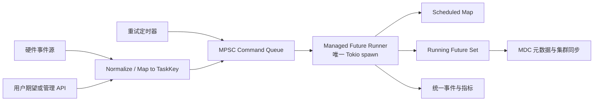

# Kube Controller 调度模型与命令驱动 Managed Future Runner

这份文档从 `kube-rs` 的 Controller 出发，解释 Kubernetes 控制器如何把“期望状态”持续收敛为“实际状态”，以及怎样把它抽象成一个适合分布式存储 MDC 的任务调度器：**只启动一个 Tokio 驱动任务，在其中统一 poll 多个 Future，并通过命令精确地调度、替换和取消每个任务。**

> 核心结论：`kube-runtime::Controller` 是一个持续协调系统，不是通用工作流引擎。它已经提供了事件合并、同 key 串行、跨 key 并发、延迟重试和统一观测等机制；但抢占、级联取消、任务优先级和外部副作用 fencing 需要在此模型上补充。

## 1. 先理解 kube 是什么

[`kube`](https://github.com/kube-rs/kube) 是 Rust 的 Kubernetes 客户端与运行时库。它主要提供两层能力：

- `kube-client`：通过 Kubernetes API 读取、创建、修改资源。
- `kube-runtime`：监听资源变化，并持续驱动 Controller、Watcher、Reflector 等运行时组件。

Kubernetes API Server 可以先理解成一个带有校验、版本、权限和事件订阅能力的“集群状态中心”。用户、CLI 或其他程序把期望状态提交给 API Server；控制器监听变化，读取实际环境，然后执行操作，使实际状态逐渐接近期望状态。

```text
用户 / 外部系统
      |
      | 修改 spec（期望状态）
      v
Kubernetes API Server
      |
      | watch 事件
      v
kube Controller
      |
      | reconcile
      v
MDC / 硬件 / 集群内部状态
      |
      | 更新 status（观测结果）
      v
Kubernetes API Server
```

### CRD 不是简单的数据库索引

```rust
#[kube(
    group = "storage.example.com",
    version = "v1",
    kind = "StoragePool"
)]
```

这段信息定义的是一种 Kubernetes API 资源的身份：

- API group：`storage.example.com`
- version：`v1`
- kind：`StoragePool`

它有一点像类型名加命名空间，但不只是索引。配合 CRD，它告诉 API Server：系统中存在这种资源、资源结构如何校验、使用哪个版本和 REST 路径访问。具体对象的数据通常包含：

```yaml
apiVersion: storage.example.com/v1
kind: StoragePool
metadata:
  name: pool-a
spec:                       # 用户期望
  replicas: 3
  devices: [disk-1, disk-2, disk-3]
status:                     # Controller 观测并回写
  readyReplicas: 2
  phase: Reconciling
```

业务关系是：CRD 定义“什么是 StoragePool”，对象的 `spec` 表达“想要什么”，Controller 的 reconciler 决定“为了达到它需要做什么”，`status` 表达“现在做到哪一步”。

## 2. Controller 的定位

Controller 是连接声明式状态和真实业务动作的持续协调循环。它通常包含以下流水线：

```text
Watcher / 外部事件流
        |
        v
触发原因 + ObjectRef
        |
        v
去重 / 延迟 / 同 key 串行调度
        |
        v
reconcile(object, context)
        |
        +--> Ok(Action) ------> 等待变化或定时再次协调
        |
        +--> Err(error) ------> error_policy -> Action
```

reconcile 不是“收到事件就执行一次命令”那么简单。它应该：

1. 读取期望状态。
2. 读取或推导当前状态。
3. 计算差异。
4. 幂等地执行一小步或一组可重试操作。
5. 更新状态，并决定是否需要再次协调。

因此，即使事件重复、丢失后重列或进程重启，只要状态仍然存在，系统仍有机会重新收敛。

### `ReconcileReason` 的作用

`ReconcileReason` 记录某个对象为什么被送入协调队列，例如：

- 主对象更新：`ObjectUpdated`
- 关联对象变化：`RelatedObjectUpdated`
- reconciler 主动要求稍后重试：`ReconcilerRequestedRetry`
- 错误策略要求重试：`ErrorPolicyRequestedRetry`
- 全量重新协调：`BulkReconcile`
- 自定义事件：`Custom`

它用于运行时调度、诊断和观测，但被刻意隐藏于业务 reconciler。原因是正确的协调逻辑应从“当前期望状态 + 当前实际状态”得出动作，而不应依赖某个可能被合并或丢失的瞬时事件原因。

## 3. 两个相同对象的事件如何处理

kube 使用对象引用 `ObjectRef` 作为调度 key。它通常由资源类型、namespace 和 name 等信息组成。

假设 `pool-a` 正在 reconcile，此时又连续来了两个 `pool-a` 事件：

```text
pool-a event #1 --> 正在运行
pool-a event #2 --+
pool-a event #3 --+--> 合并为“完成后再运行一次”的待处理状态

pool-b event   ------> 可以并发运行
```

关键语义是：

- **同一个 key 不并发执行。** 避免两个 reconciler 同时修改同一个对象。
- **事件可以合并。** Controller 关心“对象需要再协调”，而不是保证逐条消费所有事件。
- **不同 key 可以并发。** 并发度由 Controller 配置约束。

这不是每次请求到达时都去遍历 Tokio 的 task 列表查询槽位。更接近的理解是：调度器维护按 key 索引的状态，例如 scheduled、running 和 pending；新请求到达后按 key 更新这些状态。

## 4. kube 中 Scheduler 与 Runner 的分工

在 `kube-runtime` Controller 的内部模型中，可以把两部分理解为：

- **Scheduler**：决定哪个对象何时具备执行资格，负责延迟、合并和唤醒。
- **Runner**：执行具备资格的 reconcile Future，负责同 key 串行和跨 key 并发。

所以 Scheduler 是 Controller 的核心单元之一，但不是 Controller 的全部。Watcher 提供变化，Scheduler 管理执行时机，Runner 驱动 Future，reconciler 执行业务收敛，错误策略决定失败后的下一步。

### retry 从哪里来

retry 不是 Scheduler 凭空产生的。它通常来自业务执行结果：

1. reconciler 成功返回一个要求稍后再次协调的 `Action`；
2. reconciler 返回错误，`error_policy` 把错误转换成一个重试 `Action`；
3. 运行时将“对象 key + 到期时间 + reason”送回调度流；
4. Scheduler 到期后再次产出该 key；
5. Runner 再次创建并 poll 对应的 reconcile Future。

Watcher 自身为恢复 watch 连接而进行的退避重试，是另一条重试路径，不等于业务对象的 reconcile retry。

## 5. kube 默认没有解决什么

| 能力 | kube Controller 默认语义 |
| --- | --- |
| 同 key 去重与串行 | 支持 |
| 不同 key 并发 | 支持 |
| 延迟 requeue | 支持 |
| 并发上限 | 支持 |
| 取消某个运行中 reconcile | 不作为公开的一等命令提供 |
| 高优先级任务抢占低优先级任务 | 不支持 |
| 父任务取消时级联取消子任务 | 不提供通用任务树模型 |
| 暂停任意 Future 后再从原位置恢复 | Rust Future 通常不具备这种通用能力 |

这里需要区分两种“取消”：

- **停止继续 poll Future**：从运行集合移除并 drop Future 即可，属于协作式取消。
- **撤销已经发生的外部副作用**：drop Future 做不到，需要业务补偿、幂等操作、版本检查或 fencing。

抢占也只能发生在两次 `poll` 之间。如果某次 `poll` 长时间阻塞线程，任何 Tokio 调度器都无法及时抢占，因此业务 Future 必须遵守异步协作原则，不能在 `poll` 内执行长时间同步阻塞。

## 6. 面向 MDC 的 Managed Future Runner

目标架构保留 kube 最优雅的一点：**一个 driver task 统一拥有并 poll 所有业务 Future**。外部调用者不持有 Future，只发送控制命令。



### 6.1 所有权模型

- Runtime 只 `tokio::spawn` 一个 Runner driver。
- Runner 是所有运行中 Future 的唯一 owner。
- 其他组件通过 `mpsc::Sender<TaskCommand>` 请求状态变化。
- Runner 在自己的 poll loop 内处理命令并修改集合，不需要跨 task 共享 Future 的可变所有权。
- 每个 Task 必须有稳定的 `TaskKey`，例如 `{pool_id, operation_kind}`。

### 6.2 命令模型

```rust
pub enum TaskCommand<K, S> {
    Schedule {
        key: K,
        generation: u64,
        spec: S,
        not_before: Option<std::time::Instant>,
        priority: u8,
    },
    Cancel {
        key: K,
        generation: u64,
        reason: CancelReason,
    },
    Replace {
        key: K,
        old_generation: u64,
        new_generation: u64,
        spec: S,
        priority: u8,
    },
    SetPriority {
        key: K,
        generation: u64,
        priority: u8,
    },
    Shutdown {
        deadline: std::time::Instant,
    },
}
```

`generation` 是设计中不可省略的部分。它使 Runner 能识别过期命令和过期结果：generation 8 的取消命令不能错误地取消后来启动的 generation 9。

### 6.3 Runner 的状态

```rust
struct TaskEntry<F> {
    generation: u64,
    priority: u8,
    state: TaskState,
    future: Option<F>,
    cancel_reason: Option<CancelReason>,
    attempts: u32,
}

enum TaskState {
    Scheduled,
    Running,
    Cancelling,
    Completed,
}
```

实际实现可将延迟队列、running futures 和元数据分开存放，以降低 pinning 和借用管理复杂度：

- `HashMap<TaskKey, Metadata>`：权威索引和 generation 判断。
- 延迟/优先级结构：管理尚未启动的任务。
- `FuturesUnordered`、`StreamMap` 或自定义 keyed future set：只容纳运行中的 Future。

如果要求 O(1) 按 key 删除运行中的 Future，普通 `FuturesUnordered` 可能不够方便，应采用带 key 索引的容器，或用 Future 内的取消令牌请求尽快完成，再由 Runner 在完成时移除。

### 6.4 单一 poll loop

下面是概念性结构，不是可直接复制的完整实现：

```rust
loop {
    tokio::select! {
        biased;

        Some(command) = commands.recv() => {
            apply_command(command, &mut metadata, &mut scheduled, &mut running);
        }

        Some(expired) = scheduled.next() => {
            start_if_current(expired, &metadata, &mut running);
        }

        Some(completion) = running.next(), if !running.is_empty() => {
            handle_completion(completion, &mut metadata, &mut scheduled);
        }

        else => break,
    }
}
```

生产实现通常应限制单轮命令 drain 数量，避免持续涌入的控制命令饿死业务 Future。优先级也不应该仅依赖 `biased`，而应在 ready task 的选择算法中明确表达，并考虑 aging，避免低优先级任务永久饥饿。

## 7. 精确取消、替换与抢占

### Cancel

Runner 收到 `Cancel { key, generation }` 后：

1. 检查 key 是否存在。
2. 检查 generation 是否仍是当前版本。
3. 从 scheduled 或 running 集合移除。
4. drop Future，停止后续 poll。
5. 写入结构化终止事件，而不是将其记录成普通失败。

### Replace

硬件拓扑快速变化时，旧任务可能已经没有执行价值。`Replace` 应作为一个原子语义处理：

1. fencing 旧 generation；
2. 取消或标记旧 Future；
3. 安装新 spec 与新 generation；
4. 按新优先级进入 ready/scheduled 状态。

不要把 Replace 简单拆成两个可能被其他命令穿插的外部调用，否则会产生短暂空窗或误取消新任务。

### Preempt

高优先级任务到达且并发槽已满时，可以：

1. 选择一个可抢占的低优先级任务；
2. fencing 其 generation；
3. drop 旧 Future；
4. 释放槽位并启动高优先级任务；
5. 根据策略决定旧任务是重新排队、永久取消还是等待新事件。

这种抢占是“取消并以后重建”，不是保存任意 Future 的执行栈并恢复。若任务必须断点续作，进度应显式持久化为状态机，而不是依赖 Future 内部栈状态。

## 8. 级联取消但不递归 spawn

不递归 spawn 并不妨碍组合并发。父 Future 可以直接拥有多个子 Future：

```rust
async fn reconcile_pool(ctx: Context) -> Result<(), Error> {
    let update_metadata = update_metadata(ctx.clone());
    let sync_cluster = sync_cluster(ctx.clone());
    let verify_hardware = verify_hardware(ctx);

    tokio::try_join!(update_metadata, sync_cluster, verify_hardware)?;
    Ok(())
}
```

这些子 Future 由父 Future poll，并没有创建额外 Tokio task。父 Future 被 Runner drop 时，其持有的子 Future 一起被 drop，天然形成结构化的级联取消。

如果某个子操作需要被外部单独观测、调优先级或取消，就不应把它藏在父 Future 内，而应把它提升为 Runner 中独立的 `TaskKey`，并显式记录父子关系：

```text
PoolReconcile(pool-a, gen=12)
  +-- MetadataUpdate(pool-a, gen=12)
  +-- ClusterSync(pool-a, gen=12)
  +-- HardwareVerify(pool-a, gen=12)
```

取消父任务时，Runner 在一个命令事务中找到并取消其全部后代。这样仍然只有一个 driver task，不需要递归 spawn。

## 9. MDC 场景中的副作用安全

分布式存储控制面最大的风险不是 Future 是否被 drop，而是旧任务是否仍能写入 MDC 或向集群发布过期结果。建议至少采用：

- **幂等操作**：重复执行不会破坏状态。
- **generation / epoch**：每次硬件拓扑或期望状态变化都递增版本。
- **写入前比较**：只有任务版本仍是当前版本时才允许提交。
- **fencing token**：MDC 拒绝旧 token 的写入，而不是只依赖进程内判断。
- **operation id**：跨节点重试时识别同一次操作。
- **补偿逻辑**：为无法原子完成的多步副作用设计恢复路径。

一个安全的提交边界可以写成：

```text
读取 current_generation
        |
        v
计算新元数据（可取消）
        |
        v
提交前再次验证 generation
        |
        +-- 已过期 --> 丢弃结果
        |
        +-- 仍有效 --> 携带 fencing token 原子提交
```

进程内 generation 防止错误调度，MDC 侧 fencing 防止旧请求已经离开进程后仍成功写入；两者不能互相替代。

## 10. 统一观测模型

每个任务至少应产生以下字段：

- `task_key`
- `generation`
- `task_kind`
- `priority`
- `state`
- `attempt`
- `queued_at` / `started_at` / `finished_at`
- `trigger_reason`
- `terminal_reason`：completed、cancelled、replaced、preempted、failed、shutdown
- `parent_task_key`（如果存在）

建议指标：

- scheduled、running、cancelling 数量
- queue latency 和 execution latency
- 每种结束原因计数
- retry 次数与 backoff
- deduplicated / stale command 计数
- preemption 次数
- MDC fencing rejection 次数

日志和 trace 应记录标识符、状态转换和错误类型，不应记录敏感元数据内容。

## 11. 必须保持的不变量

1. 一个 `TaskKey` 最多只有一个 current generation。
2. 同一 `TaskKey` 最多只有一个运行中的 Future。
3. 过期 generation 的命令和执行结果不能改变当前状态。
4. 每个被接纳的任务最终都有且只有一个终止原因。
5. 被取消的 Future 不再被 poll。
6. 达到 shutdown deadline 后不会启动新任务。
7. 并发数永远不超过配置上限。
8. 任何旧任务都不能绕过 MDC fencing 写入新状态。

## 12. 建议测试

- 同 key 事件风暴只触发合并后的有限次执行。
- 不同 key 在并发上限内同时前进。
- 运行中 Cancel 后 Future 的 drop guard 被触发，且不再 poll。
- generation 8 的迟到完成不能覆盖 generation 9。
- Replace 不会出现旧任务与新任务同时成为 current 的窗口。
- 高优先级抢占后，低优先级任务按策略重新排队。
- 父任务取消会终止所有内嵌子 Future 或显式后代任务。
- 命令洪水下 running Future 仍能获得 poll 机会。
- 时间暂停测试中 retry/backoff 到期顺序正确。
- Runner panic 或进程重启后，可从外部状态重新构造任务，而不依赖内存中的 Future。

## 13. 推荐实施顺序

1. 先实现 `Schedule + Cancel + generation + 同 key 串行 + 并发上限`。
2. 增加 retry/backoff、dedupe 和结构化终止原因。
3. 增加 `Replace`，并在 MDC 写入端落实 fencing。
4. 增加优先级与 aging，再实现有明确策略的抢占。
5. 只有确有独立控制需求时，才把子 Future 提升为显式任务树。

这个顺序能先建立正确的生命周期和副作用边界，再增加复杂调度策略。真正决定系统可靠性的并不是“只 spawn 一个 task”，而是单一所有权、状态机、generation 和外部 fencing 能否共同成立。

## 参考

- [kube-rs repository](https://github.com/kube-rs/kube)
- [kube Controller documentation](https://kube.rs/controllers/)
- [Reasons for reconciliation](https://kube.rs/controllers/reconciler/#reasons-for-reconciliation)
- [Tokio task documentation](https://docs.rs/tokio/latest/tokio/task/)
- [`FuturesUnordered`](https://docs.rs/futures/latest/futures/stream/struct.FuturesUnordered.html)

