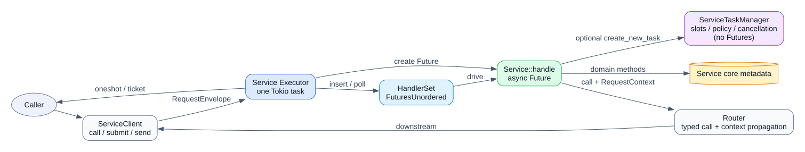

# MDC Runtime

一个面向进程内逻辑微服务的 Rust 运行时：每个 Service 只有一个 Tokio 宿主任务，由它统一 poll 该服务的全部业务 Future。

业务开发者只需要理解五个概念：

- `Service`：持有自己的核心元数据和依赖；
- `handle`：只把 Request 路由到对应的 Service 成员方法；
- 工作流成员方法：自行决定立即回复还是创建受管 Task，并定义业务步骤；
- `TaskSpec`：Task 的身份、冲突策略和业务 Future；
- `TaskContext::call`：跨 Service 调用，并自动完成父子取消传播。



## 最短示例

`handle` 不创建 Task，也不编排工作流：

```rust
fn handle(
    self: Arc<Self>,
    request: DiskRequest,
    _context: RequestContext,
) -> HandleResult<DiskResponse, DiskError> {
    match request {
        DiskRequest::Query(disk) => self.query(&disk),
        DiskRequest::Offline(disk) => self.offline_workflow(disk),
    }
}
```

工作流是普通 Service 成员方法。Task 身份、冲突策略以及是否创建 Task 都在这里决定；业务步骤可以直接顺序 `.await`：

```rust
fn offline_workflow(
    self: Arc<Self>,
    disk: DiskId,
) -> HandleResult<DiskResponse, DiskError> {
    let meta = TaskMeta::new(
        TaskKey::new(format!("disk/{disk}")),
        format!("offline disk {disk}"),
    );

    HandleResult::task(TaskSpec::new(meta, move |task| async move {
        self.metadata.begin_offline(&disk)?;

        task.call(&self.rebuild, StartRebuild { disk: disk.clone() })
            .await?;

        self.metadata.complete_offline(&disk)?;
        Ok(DiskResponse::OfflineCompleted)
    }))
}
```

查询成员方法则直接返回 `HandleResult::Reply`，不会进入 TaskSet。

`TaskContext::call` 在父任务取消时会取消下游 Task，并等待下游返回终态。正常取消不会 drop Future；只有 `ShutdownMode::Immediate` 和容器异常 Drop 才强制 abort。

## 代码入口

```text
src/
├── service/             Service trait、Client、Control、ServiceGroup
├── executor/            唯一 poll 循环与内部 TaskSet
├── task.rs              业务可见的 TaskSpec/TaskContext
├── cancellation.rs      父子取消作用域
├── observation.rs       生命周期、Idle/Busy、Task 快照与事件
├── router.rs            类型化本地路由
└── demo/                Disk → Rebuild → BG 完整示例
```

推荐先读 [开发指南](docs/developer-guide.md)，需要理解内部保证时再读 [设计说明](docs/design.md)。

## 验证

Windows：

```powershell
./scripts/test.ps1
```

Linux/macOS：

```bash
cargo fmt --all -- --check
cargo clippy --all-targets -- -D warnings
cargo test --all-targets
cargo run --example rebuild
```
