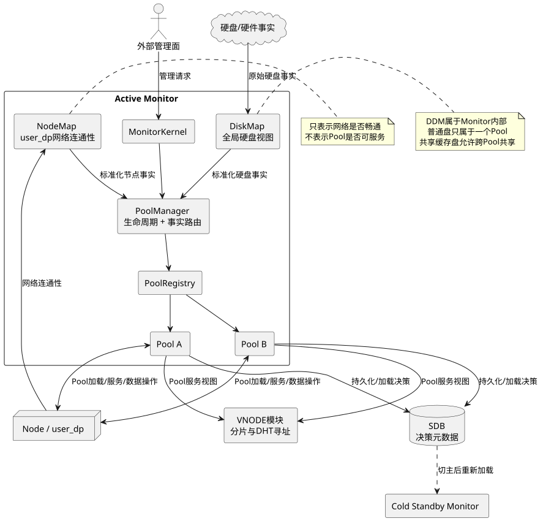

# 系统上下文

## 总体定位

Monitor 是整个存储系统的中心化管控面。Active Monitor 管理所有 Pool；冷备 Monitor 不维护可直接接管的热内存状态，切主后重新加载并构造 Pool。



图源：[system-context.puml](diagrams/system-context.puml)

## 系统参与者

| 参与者 | 对 Pool 管控面的职责 | 不属于其职责的内容 |
| --- | --- | --- |
| Monitor | 管理全部 Pool，并在全局层维护 DiskMap 和 NodeMap | 不替代 user_dp 执行 IO |
| DiskMap（DDM） | Monitor 内的全局组件，管理物理硬盘视图，向 Pool 提供硬盘资源和事实 | 不管理 VD、BG 和 Pool 逻辑空间 |
| NodeMap | Monitor 内的全局组件，表达 Monitor 与 user_dp 的网络连通性 | 不表达某个 Pool 是否在 Node 上加载或提供服务 |
| 硬件事件源 | 向 DiskMap 提供物理硬盘事实 | 不直接修改 Pool 元数据 |
| SDB | 持久化重要决策元数据，提供主切换后的加载基础 | 不是硬件和 user_dp 实际运行状态的权威来源 |
| user_dp | 在成员 Node 上加载 Pool、提供 IO、执行实际数据操作 | 不单独决定 Pool 的正式元数据布局 |
| VNODE 模块 | 管理计算资源分片和 DHT 寻址，依据服务节点和 Pool 状态进行迁移 | 不拥有 Pool 的介质和 BG 元数据 |
| 外部管理面 | 提交创建、配置、扩缩容等管理请求 | 不绕过 Monitor 直接修改 Pool 元数据 |

## Monitor 与 Pool

Monitor 的逻辑结构为：

\[
Monitor=(Role,PoolManager,PoolRegistry,Gateways,\{Pool_p\mid p\in Pools\})
\]

其中：

\[
PoolRegistry:PoolId\rightarrow Pool
\]

`Pool` 是业务对象和生命周期边界：它聚合本 Pool 的核心配置、领域能力、内存投影及其 Service 所有权。它不是通用 Runtime 的别名，也不等于一个 task。当前代码只验证了 MemberDisk Service 的一个根执行单元，以及在该根中统一 poll 事件、查询和多盘 Step Future；其他领域是否采用同样机制仍待真实实现证明。

`PoolManager` 只负责创建、恢复、卸载、查找 Pool 和按归属路由事实，不实现 MemberDisk、Tier、VD/BG 的领域策略。

## 硬盘归属边界

普通物理盘满足独占关系：

\[
owner:PhysicalDisk_{normal}\rightharpoonup Pool
\]

并且：

\[
owner(d)=p_1\land owner(d)=p_2\Rightarrow p_1=p_2
\]

物理盘由 Monitor 内的 DiskMap 管理；加入某个 Pool 后，Pool 为其建立 MemberDisk 元数据。

共享缓存盘是明确例外：

\[
users:PhysicalDisk_{shared-cache}\rightarrow \mathcal{P}(Pool)
\]

即一个共享缓存资源可以服务多个 Pool。它不能直接套用普通 MemberDisk 的独占所有权、容量记账和故障传播规则。

共享缓存层的全局所有者、DiskMap 与 Pool 的责任分工、配额模型、故障隔离和状态传播方式目前为待决问题。

## NodeMap 与 Pool 服务状态

NodeMap 只保存全局连通性视图：

\[
Connected:NodeId\rightarrow \{true,false\}
\]

Pool 在某个 Node 上是否已经加载并提供服务，是另一个 Pool 级事实：

\[
PoolServiceState:PoolId\times NodeId\rightarrow State
\]

二者不能合并。至少必须满足：

\[
Connected(n)\centernot\Rightarrow PoolServing(p,n)
\]

因此 NodeMap 可以作为 Pool 判断节点状态的输入，但不能直接生成 Pool 的可服务节点列表。

## 拓扑通知边界

所有外部拓扑变化统一经过 Monitor 内的全局 Map：

\[
HardwareChange\rightarrow DiskMap\rightarrow AffectedPools
\]

\[
NodeConnectivityChange\rightarrow NodeMap\rightarrow AffectedPools
\]

DiskMap 和 NodeMap 负责维护全局当前视图并产生标准化通知；Pool 根据自身成员关系、核心元数据和当前操作状态决定如何响应。

这一区分意味着：

- Map 通知描述“外部事实发生了什么”；
- Pool 状态机决定“该事实对这个 Pool 意味着什么”；
- Pool 工作流决定“接下来需要执行什么操作”；
- 原始外部事件格式不会渗透到 Pool 领域接口中。

## 主切换基线

已确认的恢复输入包括：

```text
SDB中的决策元数据
DiskMap重新建立的物理硬盘视图
NodeMap重新建立的网络连通性视图
user_dp上各Pool的实际服务状态
```

新 Monitor 主节点据此重新构建所有 Pool 的内存模型。当前基线只规定“内存必须可重建”，不提前规定在途工作流如何续跑。
