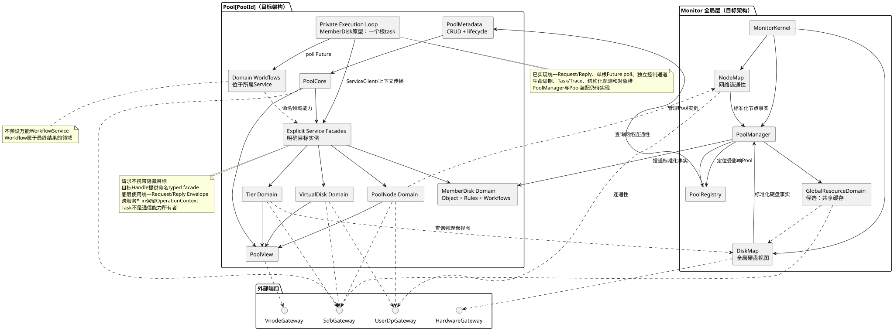

# Monitor 管控面架构

## 架构目标

- 以 Pool 作为主要隔离和管理边界；
- 让领域数据的所有者清晰，不把全部元数据放进一个共享大对象；
- 让 SDB 决策、外部事实、派生状态和运行操作彼此可区分；
- 可靠性优先，执行模型不能破坏领域不变量；
- 后续开发者主要编写业务能力和工作流，而不是理解复杂框架机制；
- 为未来并行执行或进程拆分保留显式接口，但不提前引入分布式复杂度。

## 组件视图



图源：[control-plane-components.puml](diagrams/control-plane-components.puml)

## Monitor 全局层

### MonitorKernel

职责：

- Active/Standby 角色感知；
- Monitor 启停和全局生命周期；
- 外部请求和事件入口；
- 基础设施 Gateway 装配；
- 启动 PoolManager。

### PoolManager

职责：

- 从 SDB 枚举和加载 Pool；
- 创建、恢复、卸载独立 `Pool`；
- 维护 `PoolRegistry`；
- 将 Pool 级请求和事件路由到目标 Pool；
- 协调真正跨 Pool 的能力。

`PoolManager` 不应直接实现 Tier、VD 或 BG 的业务规则。

### DiskMap（DDM）

DiskMap 是 Monitor 全局组件，管理物理硬盘视图并向各 Pool 提供硬盘身份、容量、介质和物理状态。外部硬盘拓扑变化由 DiskMap 标准化后通知受影响的 Pool。Pool 模块只消费其能力，不设计 DiskMap 内部的硬盘管理流程。

### NodeMap

NodeMap 是 Monitor 全局组件，只管理 Monitor 与 user_dp 的网络连通性。外部 Node 拓扑变化由 NodeMap 标准化后通知受影响的 Pool。它不保存某个 Pool 在 user_dp 上是否加载、Ready 或提供服务。

### 拓扑事实路由

`PoolManager` 接收 DiskMap 和 NodeMap 的标准化通知，根据 Pool 归属和成员关系投递给受影响的 Pool。普通盘使用 `Exclusive` 归属并且只能有一个目标；只有显式标记为 `SharedCache` 的资源才可以拥有多个目标。两种模式不得在同一物理盘上混用。

它只负责事实路由，不决定磁盘重建、Node 加载或 VNODE 迁移等业务策略。

### GlobalResourceDomain

该组件目前是候选边界，用于容纳真正跨 Pool 的资源关系，例如共享缓存层。

普通硬盘通过 Monitor 内的 DiskMap 接入，并由单个 Pool 独占。只有无法归入单 Pool 的业务事实才进入全局资源域，避免把 DiskMap 的硬盘管理能力复制进 Pool 模块。

## Pool

`Pool` 是单个 Pool 在 Monitor 内的业务对象、生命周期和装配边界：

```text
Pool
├── PoolMetadata / Pool CRUD
├── PoolCore
├── MemberDiskDomain / TierDomain
├── VirtualDiskDomain
├── PoolNodeDomain
├── Domain Workflows（分别定义在所属Service）
├── 显式领域 Service Facade
├── 每 Service 内部的通用 Runtime
├── PoolView
└── Reconcile
```

`Pool` 不叫 `PoolRuntime`：前者是业务概念，后者只是执行机制。当前 MemberDisk 纵切面由公共 Service Host 的一个根 task poll 多盘 Future，并复用 crate 内的 typed call、生命周期、Task/Trace、观测与对象槽；不建立虚拟 ActorCell。

### PoolCore

- Pool 基础配置、阈值和策略；
- Pool 生命周期的领域状态；
- 汇总派生状态；
- 提供 Pool 级只读视图。

PoolCore 不直接拥有全部 MemberDisk、VD 和 BG 数据。

### TierDomain

- Tier 和故障域拓扑；
- MemberDisk 的 Pool 内逻辑信息；
- BLK 空间位图；
- 空间选择、分配和释放能力；
- Partition 元数据管理。

### VdDomain

- VD 类型、冗余策略和 ChunkSize；
- BG 与 BGMap；
- BGEntry 数据有效性；
- BG、VD 健康状态计算。

当前不决定是一个 `VdDomain` 管理全部 VD，还是每个 VD 使用独立运行单元。

### NodeDomain

- Pool 成员节点；
- Pool 在各 user_dp 上的加载和服务状态；
- 将 NodeMap 连通性作为外部输入，而不是 Pool 服务状态；
- 当前可服务节点集合；
- Pool 加载/卸载能力；
- 向 VNODE 视图提供输入。

### Domain Workflows

跨领域长操作必然存在，但不建立万能 WorkflowService，也不让 Operation 成为第二套业务状态机。后续逐个场景判断：

- 操作由哪个领域发起和拥有；
- 哪些中间状态属于核心元数据；
- 哪些步骤需要调用其他领域能力；
- 工作流如何协作取消、恢复和审计；
- 是否值得抽取公共执行机制。

业务执行优先实现为所属 Service 上的自然 `async fn`。复杂可打断对象由可执行状态表读取当前转换需要的权威状态，直接选择并 `await` 一个业务步骤；随后验证声明的结束状态，再重新读取权威状态选择下一步。状态表不需要 Action enum 或内部结果事件。简单线性操作仍可以直接运行完整 Future。Operation Context 只传播因果、取消和 Trace；决定流程走向的事实必须来自其领域权威来源。

### 当前执行实现与显式领域能力

当前不规定所有领域必须服从同一种对象调度策略。公共 `ServiceRuntime` 统一 typed channel/oneshot、单根 Future poll、生命周期、Task/Trace 与观测；可选的 `ObjectTaskCoordinator<K, I, E>` 管理每个 Key 的 active/pending 输入、精确取消和 idle waiters。业务方法仍是自然 `async fn`，MemberDisk 只在一处 `ManagedService` 适配中选择哪些请求进入对象槽、哪些请求创建 Task。

所有调用都使用指向明确目标实例的 Client。请求类型不声明目的地，也不存在依据请求类型自动选择服务的全局 Router。`client.call(request)` 通过请求的静态 `Response` 类型返回结果；是否直接查询、进入 DiskUuid 对象槽或执行 BLK 分配，由目标 Service 的私有协议决定。每个实例同时暴露独立 `ServiceControl`、`ServiceObserver` 和根 `ServiceTask`。

跨领域端口仍可以提供命名能力，例如：

```rust
self.pool_nodes.publish_member_disk(&context, disk, Down).await?;
self.virtual_disks.evacuate_member_disk(&context, disk).await?;
```

内部消息枚举、channel 和 oneshot 对普通调用者不可见。MemberDisk 的每个请求通过 `ServiceRequest<MemberDiskMessage>` 静态关联响应类型，因此不需要统一 Response enum。业务代码不通过 Task 发起跨服务通信。

### MemberDisk 对象与具体执行槽

- `MemberDisk` 是唯一领域对象：直接拥有持久化的 IO、分配、成员和位图字段，不再拆出 Record/Snapshot；DiskMap 物理事实只存在于输入事件，Shrink 意图保存在 `shrink_requested`；
- `MemberDiskService` 持有 `HashMap<DiskUuid, MemberDisk>`，领域查询从该目录返回当前主上的已提交对象；
- 所有 SDB 决策字段复用私有 `commit_change` 路径：对象只读校验，`MetadataService` 提交字段级 `MemberDiskUpdate`，成功后再把同一更新应用到内存对象；
- `MetadataService` 不接收完整 `MemberDisk`，不拥有领域对象，也不提供 MemberDisk 业务查询；
- DOWN、UP、Shrink 统一进入每盘执行槽；`reconcile_once` 直接按 `(MemberDiskState, active MemberDiskEvent, shrink_requested)` 调用一个业务方法。物理事件不触发 MemberDisk 元数据更新；Shrink 第一步提交持久化管理意图；
- 每个非稳态分支完整表达 `start_state + event -> action -> finish_state`。action 通过普通 `await` 直接调用，完成后验证权威后置条件；状态表没有 Action enum、执行转发表或兜底分支；
- VDM 的 `has_references` 是 BG 引用是否清空的权威判定。它只在排空转换中读取，避免 DOWN 安全边界依赖无关服务；
- `SetDiskState::Down` 是一个动作：user_dp 接收 DOWN 的同时停止该盘 IO；
- 公共 `ObjectTaskCoordinator<DiskUuid, MemberDiskEvent, Error>` 拥有 active 事件、pending 事件队列、TaskControl 和等待者，不保存 MemberDisk 状态副本；
- MemberDisk 通过 `resolve_conflict` 普通函数声明相邻同类事件 Join、不同事件 QueueAndCancel；旧 Task 稳定返回后由 pending 事件与最新 MemberDisk 状态重新计算；测试或管理请求通过 `call(WaitMemberDiskIdle(...))` 等待；
- Shrink 排空时收到 DOWN，DOWN 进入 pending 并取消在线排空 step；VDm 稳定返回后执行不可打断的 DOWN，再由已持久化 Shrink 意图从 DI 恢复排空，前后不并发；
- 一个 MemberDisk Service 实例只有一个由 `ServiceRuntime` 创建的根 task，不为每盘创建 Tokio task/mailbox。
- 盘级 Task token 只中止恢复等待、排空和上线等可替换步骤；`set_disk_down` 不接收该 token，并在 MemberDisk 领域内重试通用广播。Drain 等待已有 Future 收敛，Stop 请求协作取消，强制停止由根 `ServiceTask` 的所有者执行 abort。

因此当前逻辑上的 MemberDisk 控制单元是 `MemberDisk`、`MemberDiskService::reconcile_once` 与同一 `DiskUuid` 下的框架执行槽。对象保存已提交能力和持久化意图，状态表决定下一步，执行槽只保存 active/pending 输入及其 Future 控制信息。

### PoolView

向外提供稳定、只读、聚合后的 Pool 视图，避免调用者直接读取多个领域内部对象并自行拼接状态。

## 业务观测平面

业务观测不能只依赖日志或运行时 Span。当前 Runtime 已实现实时快照和结构化事件；跨主持久化 Journal 仍是后续适配：

```text
OperationJournal
CausalJournal
ServiceSnapshotHub
RuntimeTraceAdapter
```

- `OperationJournal` 追加开始、里程碑、完成和结果事件，并投影当前活动；
- `CausalJournal` 保存 Event、Operation Context、状态转换及其多对多因果关系；
- `ServiceObserver` 聚合领域服务生命周期、队列、在途操作、阻塞原因和进度；
- `RuntimeTraceAdapter` 将 Task Attempt 映射到底层 Trace/Span，用于性能和代码级诊断。

TUI 查询的是结构化业务模型，而不是解析日志文本。业务因果图允许一个 BG 重建同时关联多个磁盘故障，不能被限制为严格父子树。

## 领域编排所有权

跨领域流程由“最终业务结果”的领域所有者负责。例如硬盘隔离 Workflow 属于 DiskDomain；DiskDomain 调用：

```text
VdDomain.evacuate_member_disk(...)
NodeDomain.publish_member_disk_state(...)
```

VdDomain 自治完成受影响 BG 的识别、合并和重建，NodeDomain 自治完成可服务 user_dp 的选择与同步。DiskDomain 不访问它们的元数据，也不展开它们的内部步骤。

这是一种有明确所有者的领域编排，不是全局万能 WorkflowService，也不是无人汇总结果的纯事件 choreography。OperationId 可以贯穿整条因果链，但不会替代 MemberDisk、VD、BG 等领域状态。

## 基础设施端口

Monitor 通过显式接口访问外部系统：

```text
SdbGateway
HardwareGateway
UserDpGateway
VnodeGateway
```

领域服务不应依赖外部系统的具体客户端类型。未来即使改为 RPC 或拆分进程，上层仍保持明确目标 Handle 的 typed `call(Request)` 语义。

## 建议依赖方向

如果进入代码实现，依赖方向保持：

```text
Types -> Config -> Repository/Ports -> Domain Service -> Runtime -> Interface
```

- Types 定义 Pool、Tier、MemberDisk、VD、BG、Node 等值对象和协议；
- Repository/Ports 定义 SDB、硬件事件、user_dp、VNODE 接口；
- Domain Service 实现领域规则；
- Pool 装配领域 Service；Runtime 在每个 Service 内提供执行和生命周期机制；
- Interface 处理外部 API、事件和观测输出。

## 已明确的实现约束与仍待原型验证的判断

已明确的架构约束：

- 普通业务代码使用自然 `async fn` 编排，不创建 `TaskSpec` 或包装执行主体的闭包；
- Query 不被强制包装为可观测 Task；
- Future 集合、channel、oneshot 和取消传播不进入普通业务 Workflow；
- 独立控制通道、Service 生命周期、可选 Task、Trace、结构化快照与事件由公共 Runtime 实现；
- 跨服务通信属于显式 Service facade/Client，不属于 Task；
- 核心元数据只能由所属 Service 修改，且不得把可变访问跨过 `.await`。

已经由当前 MemberDisk 纵切面验证：

- 当前 MemberDisk 使用公共 Service 根 task poll 事件、查询、BLK 申请和多盘 reconciliation Future；
- `ServiceClient::call` 已统一外部 request/response 机制；查询、事件接收和 BLK 申请由响应类型区分语义；
- `ObjectTaskCoordinator` 已承接不含 Disk 业务词汇的 active/pending/cancel/waiter 机制，MemberDisk 只提供冲突决策函数并调用已有状态表；
- MemberDisk 对象、Service 状态表/业务步骤与 Runtime 执行槽的职责分离；
- 自然 `async fn` 业务方法、显式领域 facade、完整收敛路径，以及新事件等待旧 Future 稳定退出后重新计算。

尚未实现的是 `PoolManager -> Pool -> Domain ServiceInstance` 多 Pool 装配、生产级观测持久化。仍待验证的是 BLK 分配从当前全局串行临界区演进到 Tier/Partition 并行、完整 VD/BG 恢复语义和真实 SDB 条件写适配器，而不是重新引入隐藏路由或每对象 task。
