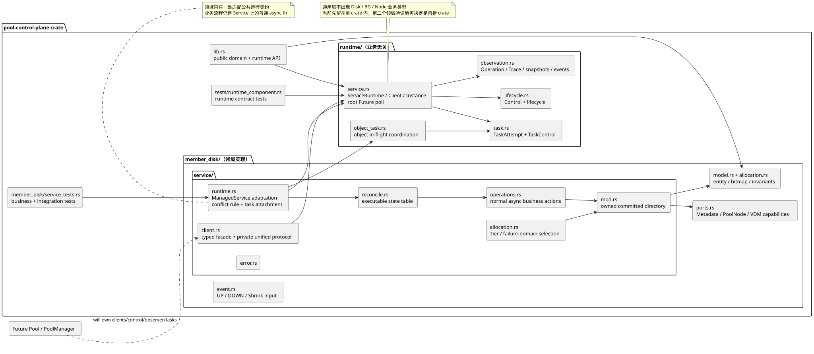

# 当前代码布局与演进边界

状态：与当前最小 MemberDisk 纵切面一致。

## 1. 当前决策

仓库现在只有一个 library crate：`pool-control-plane`。我们暂时不建立
`control-runtime`、独立 Domain crate、通用 Actor、状态机框架或 Router。

原因很直接：目前只有 MemberDisk 一个真实纵切面。先让业务顺序、冲突规则和持久化
边界在具体代码中变得清楚，等第二个领域出现相同机械代码后，再以真实重复为依据提炼。

这不否定未来的公共运行时；它只禁止为了预想中的统一性，提前让开发者理解尚未被业务
证明的抽象。

## 2. 当前目录是代码事实

```text
kube-managed-future-runner/
├── README.md
├── Cargo.toml
├── Cargo.lock
├── src/
│   ├── lib.rs
│   └── member_disk/
│       ├── mod.rs
│       ├── allocation.rs
│       ├── model.rs
│       ├── event.rs
│       ├── ports.rs
│       ├── service/
│       │   ├── mod.rs
│       │   ├── client.rs
│       │   ├── error.rs
│       │   ├── reconcile.rs
│       │   ├── operations.rs
│       │   └── runtime.rs
│       ├── model_tests.rs
│       ├── service_tests.rs
│       └── ...
└── docs/
    ├── *.md
    ├── diagrams/
    └── assets/
```



图源：[package-workspace-layout.puml](diagrams/package-workspace-layout.puml)

## 3. MemberDisk 文件职责

### `model.rs`

保存 `MemberDisk` 实体、值对象、字段级 `MemberDiskUpdate` 和领域不变量。

- `MemberDisk` 是核心业务状态唯一载体；
- `MemberDiskState` 只是字段投影，不保存第二份状态；
- `validate_update` 在 SDB 写入前验证；
- `apply_committed` 只接纳已经提交的更新。

### `allocation.rs`

保存 BLK 大小规则和当前语义级位图实现。它不是最终 SDB Partition 物理布局。

### `event.rs`

保存 MemberDisk 接受的外部事件。DiskMap 的物理 UP/DOWN 和管理面的 Shrink 使用同一
`MemberDiskEvent` 入口；外部统一使用 `DiskUuid`，事件不携带隐藏 ServiceId，也不触发
全局自动路由。

### `ports.rs`

保存 MemberDisk 依赖的明确能力：

- `MetadataService`：提交 `DiskUuid + MemberDiskUpdate`；
- `PoolNodeService`：向当前可服务 Pool 节点执行一次 user_dp 广播；是否重试由调用领域决定；
- `VirtualDiskService`：查询该盘是否仍被 BG 引用，并排空这些引用；VDM 是该关系的权威来源。

这些 trait 是领域边界，不是通用 Runtime trait。

### `service/mod.rs`

保存 `MemberDiskService` 本体、对象目录以及唯一的 SDB-first 提交入口：

- `new` 负责依赖和初始对象装配；
- `get_member` 返回一次完整的只读对象快照；
- `commit_change` 是业务动作完成后的 `validate -> SDB -> memory` 修改路径；
- 物理事件不会通过该路径写入 MemberDisk。

### `service/reconcile.rs`

保存 MemberDisk 的协调决策。`reconcile_once` 穷举
`(业务投影, active MemberDiskEvent, shrink_requested)`，并直接调用一个具体异步行为。
顶层只按 `UpActive / UpInactive / DownActive / DownInactive / Removed` 分派到对应
状态函数；每个状态函数再完整列出“未缩容/缩容中 × DOWN/UP/Shrink”的规则。每个执行
分支表达 `start_state + event -> action -> finish_state`，action 返回后验证权威结束状态。
这里没有 Action enum、函数表或独立状态副本，也不依赖通配符的匹配顺序隐藏业务优先级。

### `service/operations.rs`

保存状态表调用的单一业务行为，例如 `set_disk_down`、等待恢复窗口、排空、移除和上线。
开发者可以从状态表中的一个分支直接跳到对应方法，方法仍使用普通 `async/await` 编排。
禁止把排空、停 IO 和移除重新包装成一个复合 action。

### `service/client.rs`

保存对外 `MemberDiskClient` 和私有 `ServiceMessage`。Client 只封装 mpsc 与 typed
oneshot，不读取对象、不判断冲突，也不创建任务。

### `service/runtime.rs`

保存 `MemberDiskService::run` 和 Future 完成结果等纯执行细节。`run` 使用一个根 Tokio
task poll 事件准入、查询和多盘 reconciliation Future；每盘运行槽保存 active 事件、
pending 事件、`CancellationToken` 和 idle waiters，不复制 MemberDisk 业务状态，也没有单独的
`ServiceLoop` 对象。

### `service/error.rs`

保存 `MemberDiskServiceError` 以及 Metadata、PoolNode、VDm 端口错误到服务错误的转换。

这次拆分只是同一个 `MemberDiskService` 的物理代码组织，不产生新的 Service、Actor、
独立 Reconciler 实例或公共 Runtime trait。所有子文件仍然实现同一个 Service，外部 API 不变。

## 4. 当前调用路径

```text
Pool/PoolManager（后续装配）
    -> MemberDiskClient
    -> private ServiceMessage + oneshot
    -> MemberDiskService::run（唯一根 task）
       -> 事件准入（只校验该 Pool 拥有对应 MemberDisk）
       -> active[DiskUuid]（同盘至多一个 active 事件，其余进入 pending）
       -> MemberDiskService::reconcile_once
          -> 状态表直接 await 一个 async action
          -> 验证声明的 finish_state
          -> MetadataService / PoolNodeService / VirtualDiskService
       -> 重新读取 MemberDisk，直到达到稳态
```

查询也经过 `MemberDiskClient`，但只读取 `MemberDiskService` 的对象目录，不创建
reconciliation Future。

## 5. 依赖方向

当前 crate 内保持：

```text
Value Objects / Model
        <- Event and Ports
        <- MemberDiskService state table and business steps
        <- private execution loop
        <- MemberDiskClient
```

其他领域不得获得 `MemberDisk` 可变引用。未来的 `Pool` 只保存领域 Client/Facade，
跨领域修改继续通过命名能力完成。

## 6. 何时提炼公共 crate

只有出现真实证据才升级抽象：

1. 第二个领域重复了单根 Future poll、active/cancel/repoll 和停止语义；
2. `service/runtime.rs` 中的机械逻辑可以在不引用 Disk、Node、VD 等业务词汇的前提下复用；
3. 搬走后状态表与普通 `async fn` 业务步骤仍保持当前可读形状；
4. 公共层不需要业务回调表、类型擦除或隐藏路由来维持统一；
5. 独立发布、复用或构建隔离确实需要新的 crate。

仅仅“这个概念很重要”或“以后可能复用”都不足以拆 crate。

## 7. 当前已实现与未实现

已实现：

- 完整 `MemberDisk` 对象和 BLK 位图；
- SDB 先提交、成功后更新内存的字段级修改路径；
- DOWN、UP、Shrink 的统一 `MemberDiskEvent` 输入；
- DiskMap 物理事实由 active/pending 事件持有，不复制进 MemberDisk；
- `shrink_requested` 作为 Pool 管理意图持久化；
- 穷举状态表直接调用领域 `async fn`，每步提交后重新读取对象；
- 同盘一个 active reconciliation，不同盘 Future 由同一根 task 并发 poll；
- 不同事件到达时协作停止当前 step，稳定返回后处理 pending 事件；
- Shrink 中收到 DOWN 时保留 Shrink 意图，先稳定结束在途排空，再从新状态继续；
- Query 不创建 reconciliation Future；Client 不持有 Service。

尚未实现：

- `PoolManager -> Pool -> MemberDiskClient` 的多 Pool 装配；
- 独立控制通道和完整生命周期状态观测；当前只有 Channel Close 隐式 Drain 与外部 `JoinHandle::abort`；
- Task/Trace/TUI 观测；
- 通用执行 crate；
- Tier、VD/BG、PoolNode 的真实实现和 SDB Adapter；
- 切主后的在途操作恢复协议。

文档不得把这些待办描述为当前代码已经具备的能力。

## 8. 验证

```text
cargo fmt --all --check
cargo test --offline
cargo clippy --offline --all-targets -- -D warnings
```

仓库根目录还应执行 `npm run verify`，保证本次子项目修改没有破坏 JurisDesk 的仓库级
约束。
