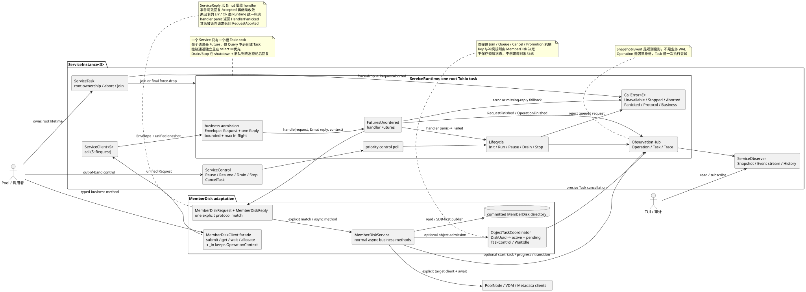
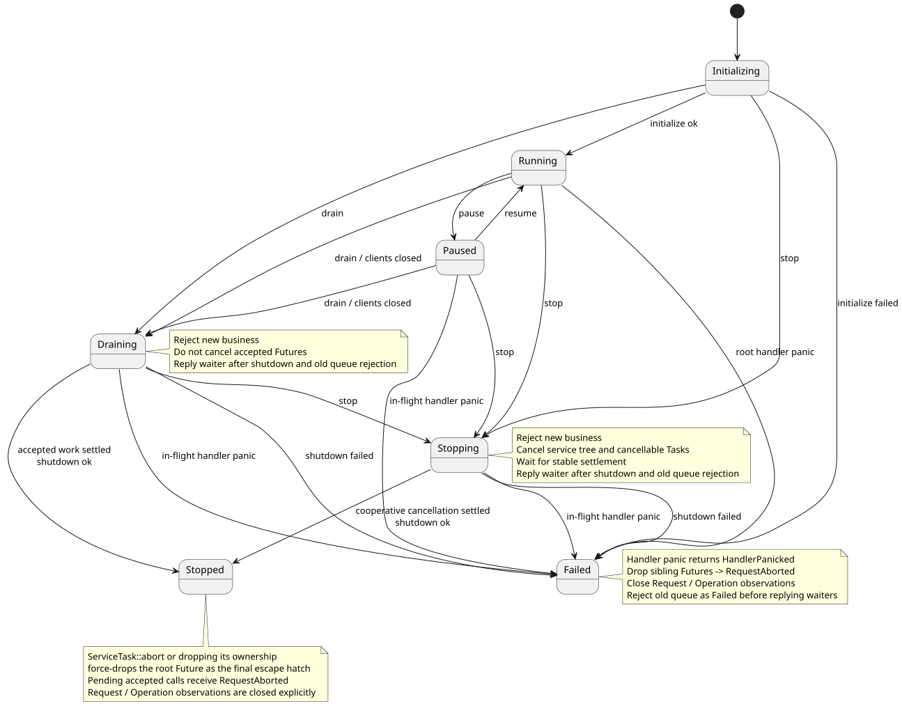

# Service Runtime：生命周期、任务与观测

状态：`B0.7 已实现`。

本章定义 Pool 内领域 Service 共用的运行组件。它解决的是“服务如何运行和被管理”，而不是
“某个业务下一步应该做什么”。MemberDisk 是第一个适配者，Node、VD、BG 可以复用同一
运行契约，但不要求复用 MemberDisk 的对象冲突策略。



## 1. 边界

Runtime 负责：

- 统一 Request/Reply Envelope、oneshot 返回通道与容量背压；
- 用 `CallError` 分离生命周期/通信/协议错误和领域业务错误；
- 一个根 task 统一 poll 多个 handler Future；
- 高优先级控制通道与服务生命周期；
- 请求、Operation、Task 和 Trace 的关联；
- Task 进度、里程碑、阻塞原因、精确取消和完成结果；
- 同 Key 在途工作所需的 Join/Queue/Cancel/Promotion/WaitIdle 机械机制；
- 当前快照、实时结构化事件和可插拔导出；
- 协作停服以及最终强制回收。

Runtime 不负责：

- 判断 DOWN 是否覆盖 UP，或 Shrink 是否必须继续；
- 决定 BG 如何重建、Tier 如何选盘、Node 如何广播；
- 保存领域对象的权威状态；
- 把业务流程改写成 Action DSL；
- 根据请求类型猜测目标服务。

## 2. 一个实例，四类句柄

`ServiceRuntime::spawn(service, config)` 返回 `ServiceInstance<S>`，其中 `S: ManagedService`：

| 句柄 | 面向谁 | 职责 |
| --- | --- | --- |
| `ServiceClient<S>` | 业务 facade | `call(S::Request)`；目标实例已由持有的 Client 明确 |
| `ServiceControl` | Pool/运维控制面 | Pause、Resume、Drain、Stop、CancelTask |
| `ServiceObserver` | TUI、测试、审计适配器 | 当前快照、watch 变更、事件订阅、有限历史 |
| `ServiceTask` | Pool 所有者 | 持有唯一根 Tokio task；Join 或故障隔离 Abort |

Client 不持有业务 Service 对象，也不能绕过 mailbox 直接访问元数据。Control 使用独立有界
通道，并在根循环的 `select!` 中具有优先级，不会被业务队列挤占。Observer 只读。Task 的
所有权必须保存在 Pool 的装配结构中；直接丢弃它会触发 abort，从机制上避免根 task 泄漏。

## 3. 生命周期



| 当前状态 | 接受新业务 | 已接收 Future | 允许的主要控制 |
| --- | --- | --- | --- |
| `Initializing` | 可以进入有界队列，等待初始化完成 | 尚未启动 | Drain、Stop |
| `Running` | 是 | 正常 poll | Pause、Drain、Stop、CancelTask |
| `Paused` | 否，立即返回明确错误 | 继续 poll | Resume、Drain、Stop、CancelTask |
| `Draining` | 否 | 不取消，等待自然完成 | Stop、CancelTask |
| `Stopping` | 否 | 请求协作取消，等待稳定退出 | CancelTask |
| `Stopped` | 否 | 无 | 无 |
| `Failed` | 否 | 无 | 无；由所有者决定重建实例 |

三个关闭语义必须区分：

- `drain()`：停止接收新业务，不取消已接收 Future；全部完成并执行 `shutdown()` 后返回；
- `stop()`：取消 Service 根 token 和所有可取消 Task，等待业务在稳定边界退出，再执行
  `shutdown()`；
- `ServiceTask::abort()`：直接 drop 根 Future，只用于超时、故障隔离或进程卸载的最后手段。

`drain()` / `stop()` 的控制 Future 不会在状态刚切换时提前返回。Runtime 先等待已接收工作
稳定结束并完成 `shutdown()`，再关闭旧业务队列；shutdown 成功时以 `Stopped` 拒绝竞态入队
请求并回复控制 waiter，失败或 panic 时则先以 `Failed` 拒绝旧队列，再向 waiter 返回失败。
因此控制调用返回时，旧队列中不存在仍在等待结果的调用者。

初始化和关闭 hook 都可以读取 `ServiceContext::cancellation()`。因此 Stop 能协作结束阻塞的
初始化；不响应取消的第三方调用仍由上层超时后执行强制 abort。

Runtime 单独捕获每个 handler panic。发生 panic 的调用者收到
`CallError::HandlerPanicked(message)`，对应 Request/Operation 被明确记为失败，实例进入
`Failed`；随后 Runtime 取消并 drop 其余在途 Future，通过完成守卫为它们发出
`RequestFinished/OperationFinished`，尚未回复的调用者收到 `CallError::RequestAborted`。旧队列
最终统一以 `ServiceUnavailable::Failed` 拒绝。普通 handler 返回 `Err` 只表示该请求失败，
Service 仍可继续运行。

`ServiceTask::abort()` 或提前丢失根 task 所有权是另一条强制 drop 路径。`ServiceReply` 和请求
完成守卫在析构时分别返回 `RequestAborted`、闭合 Request/Operation 观测，避免调用者只看到
模糊的 oneshot 断开，也避免 TUI 永久残留“运行中”记录。正常 Drain/Stop 不产生
`RequestAborted`。

## 4. Future、Operation 与 Task 不是同一个概念

```text
Request
  -> handler Future                 每个请求都有，由根 task poll
       -> OperationContext          有业务意义的请求才可观测，跨服务保持因果身份
            -> TaskAttempt (0..n)   需要进度、审计或控制时才创建
```

Query 仍是 Future，但通常没有 Operation 事件和 Task。业务工作流也不需要被塞进
`TaskSpec::new(move || ...)`：Runtime 已经在执行 `service.handle(...)` 产生的 Future；业务在
真正需要管理的阶段调用 `context.start_task(...)`，只是给当前工作附加控制与观测，不改变
正常 `async fn` 的书写方式。

`OperationContext` 是稳定的因果身份，包含 OperationId、scope、kind 和 TraceContext；它不
保存业务 phase/status。`TaskAttempt` 是一次临时执行尝试。影响恢复正确性的事实必须提交到
领域 SDB，不能只存在于 Operation 或 Task 记录里。

跨 Service 协作通过目标 Client 显式调用：

```rust
let bg = pool.bg_service();
let reply = bg.call_in(context.operation(), RebuildBg { bg_id }).await?;
```

这里负责通信的是 `bg` Client；`call_in` 只传播因果身份。Task 不负责路由或 RPC。

MemberDisk 的公开 facade 同时提供根调用和跨服务调用两组方法：

```rust
member_disks.submit(event).await?;
let allocation = member_disks
    .allocate_blks_in(context.operation(), request)
    .await?;
```

`submit_in/get_in/wait_idle_in/allocate_blks_in` 与不带 `_in` 的业务语义完全相同，只是把调用者
已有的 `OperationContext` 传给底层 `call_in`，从而跨 Service 保留 operation 与 trace 因果链。

## 5. 统一 Request/Reply 协议

一个 Service 只关联一组请求、一组回复和一种领域错误。返回通道不藏在请求 enum 的各个
变体中，而是由 Runtime 的通用 Envelope 统一持有：

```rust
struct BusinessEnvelope<S: ManagedService> {
    operation: OperationContext,
    request: S::Request,
    reply: oneshot::Sender<Result<S::Reply, CallError<S::Error>>>,
}
```

因此 Runtime 无需理解 `MemberDiskRequest` 的业务变体，也能在 Pause、Drain、Stop 或初始化
失败时直接拒绝一个排队请求。`CallError<E>` 保留错误边界：

- `Unavailable(reason)`：生命周期暂不接受请求；
- `ServiceStopped`：根 task 或业务通道已经结束；
- `RequestAborted`：已接收请求因终态故障被强制 drop，而不是正常协作取消；
- `HandlerPanicked(message)`：当前 handler panic，Service 随即进入 `Failed`；
- `ProtocolViolation(message)`：handler 没有按协议回复，或 facade 收到错误的 Reply 变体；
- `Business(E)`：领域 handler 返回的业务错误。

领域实现的最小接口如下：

```rust
#[async_trait]
impl ManagedService for MemberDiskService {
    type Request = MemberDiskRequest;
    type Reply = MemberDiskReply;
    type Error = MemberDiskServiceError;

    async fn initialize(
        &self,
        context: ServiceContext,
    ) -> Result<(), Self::Error> { /* 可选 */ }

    async fn handle(
        self: Arc<Self>,
        request: Self::Request,
        reply: &mut ServiceReply<Self::Reply, Self::Error>,
        context: RequestContext,
    ) -> Result<(), Self::Error> {
        match request {
            MemberDiskRequest::ApplyEvent(event) => {
                self.handle_event(event, reply, context).await
            }
            MemberDiskRequest::Get(disk) => self.handle_get(disk, reply).await,
            // 其余变体保持一处显式分发。
        }
    }

    async fn shutdown(
        &self,
        context: ServiceContext,
    ) -> Result<(), Self::Error> { /* 可选 */ }
}
```

`ServiceReply` 以 `&mut` 借给 handler，只允许第一次发送成功。这样事件 handler 可以先调用
`reply.send(MemberDiskReply::Accepted(...))`，立即兑现“已接收”的承诺，再继续在同一个
handler Future 中驱动对象收敛。Runtime 对遗漏回复提供统一兜底：

- handler 在回复前返回 `Err(error)`：自动返回 `CallError::Business(error)`；
- handler 返回 `Ok(())` 但没有回复：自动返回 `CallError::ProtocolViolation`；
- handler 已提前回复，随后才返回错误：不能也不应发送第二个结果，Runtime 将失败记录到请求
  和 Operation 观测；若该流程创建了 Task，领域还应以对应 `TaskOutcome` 结束它。调用者若关心
  最终完成，应显式调用 `wait_idle` 或查询领域状态。

`MemberDiskClient` 是公开领域 facade，内部包装 `ServiceClient<MemberDiskService>`，把统一的
`MemberDiskReply` 投影为 `submit -> Accepted`、`get -> MemberDisk`、`wait_idle -> ()`、
`allocate_blks -> Allocation`，并为四种能力提供保留 `OperationContext` 的 `_in` 版本。这不是
自动路由：调用方仍必须先持有准确的 Service Client。协议 enum 的一处显式 match 避免全局
Router、异步类型擦除和隐藏注册表。

## 6. 对象在途任务协调

MemberDisk 需要“同盘一个活动意图”，而 BLK 申请不需要。这个差异由领域选择是否使用
`ObjectTaskCoordinator<K, I, E>`，Runtime 不强迫所有请求进入对象槽。

```text
admit(key, input, domain_decision)
  Idle                 -> Active(ObjectLease)
  相同意图              -> Joined
  冲突意图              -> Pending；可选请求当前 Task 协作取消

active lease finish
  -> 按顺序提升一个仍有效的 Pending
  -> 无 Pending 时唤醒 WaitIdle，并保存最近结果
```

Coordinator 只执行机制。MemberDisk 的 `resolve_conflict` 决定相邻同类事件 Join、不同事件
QueueAndCancel。它保存的是运行槽位，不是 MemberDisk 状态副本，也不创建每盘 Tokio task。
槽位关联 `TaskControl` 后，业务冲突与运维 `cancel_task(id)` 走同一套精确取消路径。

## 7. 取消协议

取消令牌形成一棵树：Service token -> Request token -> ObjectLease/Task token -> 下游调用。
业务不需要在每一行检查 `is_cancelled()`；可取消等待使用 `select!` 或下游接口接收 token，
不可取消边界则故意不接收该 token。

MemberDisk DOWN 展示了两种边界：

1. 给所有可服务 user_dp 设置 DOWN/停 IO 是可靠性边界，不被 UP、Shrink 或 Stop 中途打断；
2. DOWN 已生效后，恢复窗口和 VDM 排空是可协作取消阶段；
3. 新事件只请求取消，旧 Future 稳定返回后 pending 才被提升；
4. 强制 abort 只由 ServiceTask 所有者在关闭超时后执行。

因此 Cancel 表示“请求尽快停在安全点”，不是“立刻 drop 任意 Future”。

## 8. 观测契约

`ServiceSnapshot` 提供：

- lifecycle、Idle/Busy；
- queued/in-flight、accepted/completed/rejected 计数；
- active Task 列表；
- 每个 Task 的 operation_id、trace_id、key、kind、状态、进度、里程碑、blocked_on；
- 最近错误。

`RuntimeEvent` 提供追加式结构化事件：生命周期和活动边沿、请求接收/拒绝/完成、Operation
开始/完成、Task 开始/进度/阻塞/取消/完成、领域对象状态转换。TUI 可以先读 Snapshot，再
订阅 Event 做增量更新，不需要解析日志。

`RuntimeEventSink` 是同步、非阻塞适配器；适配器应只做内存入队，持久化或网络发送由它
自己的 worker 完成。Runtime 捕获 sink panic，观测故障不能改变业务结果。内置 history 是
有限环形缓存，仅供实时诊断和测试，不是审计数据库或业务 WAL。

## 9. 可测试性

组件测试不依赖 sleep 猜测状态，而是通过 Observer、Semaphore 和 Control 精确同步：

- 初始化可见且请求在初始化期间等待；
- Pause 拒绝新请求，Resume 恢复；
- Drain 等待已接收工作，Stop 协作取消；
- 按 TaskId 精确取消并审计原因；
- Query 不产生 Task；Idle/Busy 只在边沿变化；
- 强制 abort 以及丢失 ServiceTask 所有权都不会泄漏 Future；
- 结构化事件可导出；
- handler panic 返回 `HandlerPanicked`、使服务进入 `Failed`，并以 `RequestAborted` 闭合被
  丢弃的其他在途请求；
- panic/abort 都产生配对的 RequestFinished/OperationFinished，Drain/Stop 在 shutdown 与旧
  队列终态拒绝完成后才回复控制 waiter；
- MemberDisk 重复 DOWN 合并，UP 冲突取消，状态转换和 Trace 可见；
- 有在途生命周期事件的磁盘不会参与新 BLK 分配。

## 10. 当前限制与后续扩展

- Runtime 是当前单 crate 内的独立模块。第二个真实领域接入后若 API 仍稳定，再考虑拆 crate；
- 内置历史只在内存中。跨 Monitor 主切换的审计存储需要实现外部 `RuntimeEventSink`；
- Service Runtime 不替代 `PoolManager -> Pool -> Domain Client` 多 Pool 装配；该层仍待实现；
- 第一阶段 MemberDisk 修改由一个 `mutation_gate` 串行。以后可以按 Tier/Partition 缩小并行
  粒度，但必须保持 SDB-first、无重复分配和释放顺序不变量；
- 需要恢复的长流程必须从领域 SDB 和现实状态重新收敛，不能反序列化 Future 或 Task。
