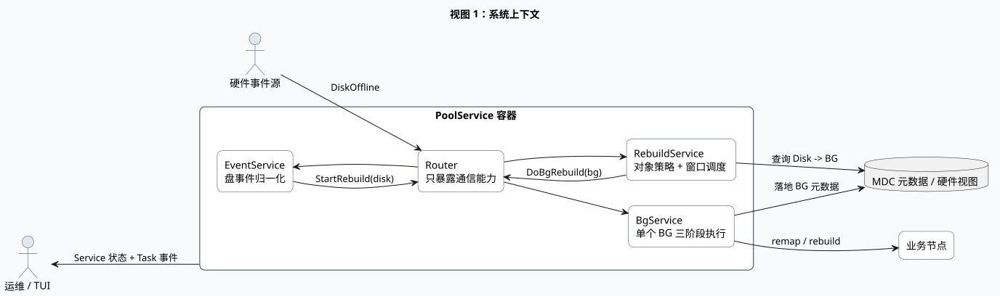
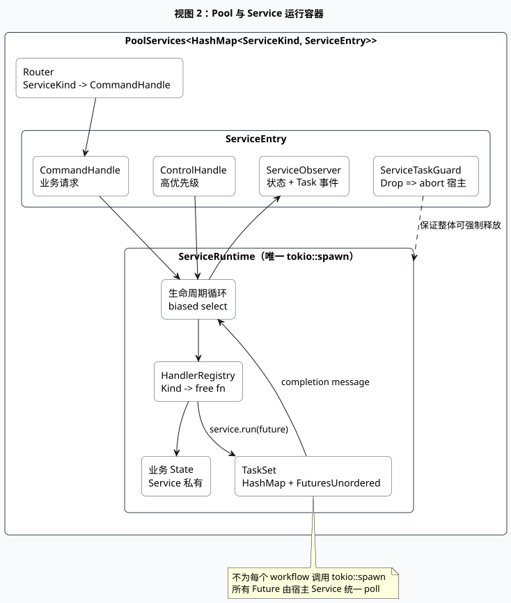
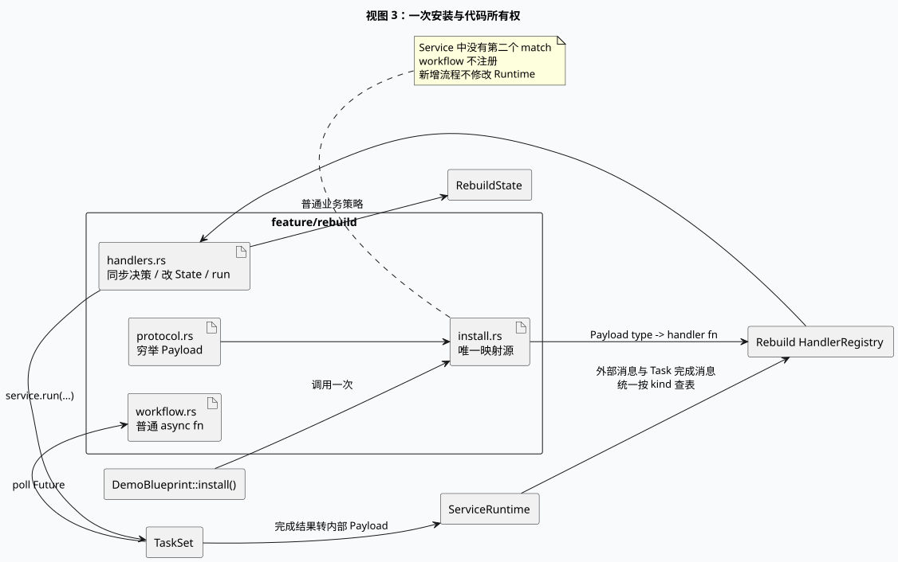
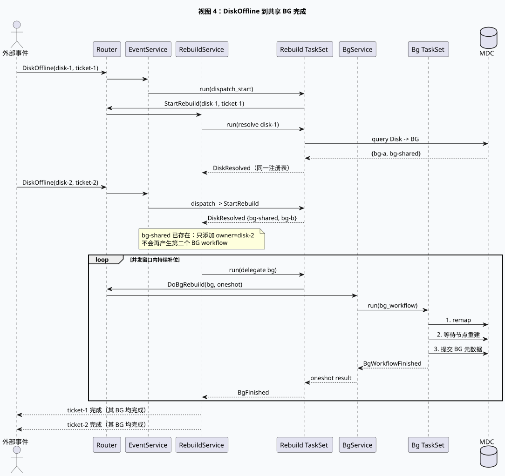
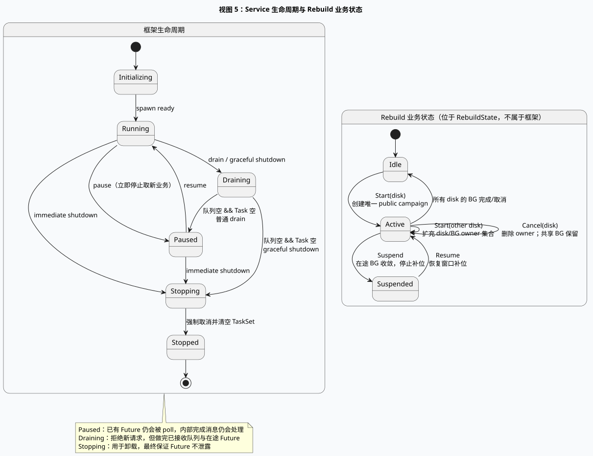

# MDC Service Runtime 设计说明

## 1. 设计结论

这版设计有意删除“为了统一而统一”的公开抽象。业务开发接口只保留：

```text
Service = State + HandlerRegistry + TaskSet + Lifecycle
Message = 外部请求或内部完成事件
Task    = 被 Service 统一 poll 的 Future
Router  = Service 之间的类型化通信目录
```

不公开 Scheduler trait。调度策略真实存在，但它是具体模块的对象状态与 handler 规则，而不是每个开发者都必须实现的一套框架协议。

## 2. 五视图

### 2.1 系统上下文视图



PoolService 是 Pool 对象的所有权边界。外部只能拿到其子服务通信句柄，不能通过 `PoolMap` 取得 Pool 对象。Event、Rebuild、BG 分工清楚，并通过 Router 协作。

PlantUML 源码：[01-context.puml](diagrams/01-context.puml)。

### 2.2 运行容器视图



每个 Service 只调用一次 `tokio::spawn(runtime.run())`。TaskSet 用 `FuturesUnordered` poll 任意数量业务 Future；Task 不是 Tokio task。ServiceTaskGuard 是卸载保险：Entry 被丢弃时 abort 宿主，所有内部 Future 随容器 Drop。

PlantUML 源码：[02-runtime-container.puml](diagrams/02-runtime-container.puml)。

### 2.3 Feature 与代码所有权视图



`install.rs` 是唯一映射源。它不是 workflow 的执行器，只负责把静态 Payload 类型绑定到自由 handler。workflow 不注册；Future 完成后产生内部 Payload，再走同一张表。

PlantUML 源码：[03-feature-install.puml](diagrams/03-feature-install.puml)。

### 2.4 重建动态视图



EventService 的 workflow 通过 Router 请求 RebuildService 并 await ticket。RebuildService 查询 Disk→BG、维护 BG owner 集合和并发窗口。BgService 执行单 BG 三阶段流程。一个 Service 等待另一个 Service，是两个受控 Future 协作，不是模块持有或递归 spawn。

PlantUML 源码：[04-rebuild-sequence.puml](diagrams/04-rebuild-sequence.puml)。

### 2.5 状态视图



框架生命周期与 Rebuild 业务状态严格分离。运维 Pause/Drain/Shutdown 不侵入业务协议；Suspend/Resume/Cancel 不侵入框架 Runtime。

PlantUML 源码：[05-state.puml](diagrams/05-state.puml)。

## 3. 核心抽象

### 3.1 `PoolServices<K, M>`

每个 Pool 一个容器，持有：

```rust
HashMap<ServiceKind, ServiceEntry<ServiceKind, PoolMessage>>
```

`ServiceEntry` 正是此前讨论的四元组：

```text
CommandHandle + ControlHandle + ServiceObserver + ServiceTaskGuard
```

Router 只保存 CommandHandle 的克隆，因此不会获得 Service State 或 Pool Object 权限。

### 3.2 `HandlerRegistry`

Registry 按宏生成的 `MessageKind` 查表。注册函数签名为：

```rust
Fn(&mut ServiceContext<K, M, S>, Payload) -> Result<(), RuntimeError>
```

它同步执行，保证对 Service State 的修改串行化。业务只要定义 Payload、自由函数和一次安装，不实现 trait。

### 3.3 `ServiceContext`

handler 能做的事情被刻意限制：

- 读写自己的 `state`；
- 读取当前 operation/trace；
- `run` 一个 Future；
- 按稳定 TaskKey 查询/取消 Future；
- 克隆 Router 作为 workflow 的最小通信能力。

它不能直接 poll Task，不能拿 JoinHandle，也不能碰另一个 Service State。

### 3.4 `TaskSet`

TaskSet 同时持有：

```text
HashMap<TaskKey, TaskSlot>       // 身份、排重、取消定位
FuturesUnordered<TaskCompletion> // 唯一 poll 载体
```

所以 Scheduler/Runner 的职责不再含糊：

- Runtime 循环负责消息、生命周期和调用 handler；
- 具体 handler/State 负责业务准入、合并、互斥、窗口；
- TaskSet 负责 Future 身份、排重底线、取消、poll 和完成事件；
- Tokio JoinHandle 只代表整个 Service，不代表每个业务 Task。

### 3.5 `Router`

Router 是每个 Pool 的能力目录：

```rust
Router<ServiceKind, PoolMessage>
```

上层 `PoolMap` 可以保存 `PoolServices` 暴露出来的 facade/Router/typed API，但不保存 Pool Object。Global 层若需要分发到多个 Pool，应遍历通信句柄并 await ticket；Pool 数据仍只在 PoolService 权限边界内。

## 4. 重建对象模型

### 4.1 三层身份

| 层次 | 身份 | 作用 |
|---|---|---|
| Campaign | 每个 Pool 最多一个 | 对用户展示“存储池正在重建” |
| DiskJob | 每个 Disk 一个发起者 | 跟踪该 Disk 尚未完成的 BG，并拥有唯一完成 ticket |
| BgJob | 每个 BG 一个 | 真正重建单元，owners 可含多个 Disk |

这解决“对外一个任务，内部又真实存在多个任务”的矛盾。可见性是 Task 元数据，不需要伪造或删除内部任务。

### 4.2 合并

收到 DiskResolved 后，对每个 BG：

```text
不存在 -> 创建 BgJob{Queued, owners={disk}} 并入队
已存在 -> owners.insert(disk)，不创建第二个 Future
```

排重的业务依据是 `RebuildState.bgs`；TaskSet 的 `TaskKey` 排重只是最终安全网。不能只用 Executor 的 `contains` 替代 owner/对象规则。

### 4.3 窗口

`refill` 只做：

```text
while !suspended && running < window:
    从 queue 取 BG
    标记 Running
    run(delegate_bg_workflow)
```

每个 `BgFinished` 先将 `running -= 1`，再调用 `refill`。窗口默认可设 10；Demo 测试使用较小窗口以验证行为。

### 4.4 取消

取消 Disk 时：

1. 删除它的 DiskJob，并只通知该唯一发起者；
2. 从关联 BgJob 的 owners 删除该 disk；
3. 仍有 owner 的 BG 不动；
4. 无 owner 且 Queued 的 BG 从队列删除；
5. 无 owner 且 Running 的 BG 向 BgService 发送 Cancel；
6. BgService 用 TaskKey 精确 force-cancel 自己的 BG Future。

级联关系由业务 owner 图决定，不由框架盲目“父任务取消全部孩子”。这是动态共享 BG 场景与普通树形 workflow 的关键差异。

### 4.5 Suspend

Suspend 是“停止补位”，不是 abort：

1. `suspended = true`；
2. 不再从 queue 取新 BG；
3. 当前 running BG 正常完成；
4. `running == 0` 时完成 Suspend ticket；
5. Resume 后重新 refill。

## 5. 选择自由函数而不是 Service 成员方法

handler/workflow 使用自由函数，State 保持纯业务数据：

- 安装表能直接看到协议到实现的完整映射；
- 测试可直接构造 State 和依赖；
- ServiceRuntime 不随业务膨胀；
- workflow 只获得最小上下文，不会顺手调用任意 Service 私有方法。

需要强不变量时，把它写成 State 的小方法；不要把所有流程塞回一个巨大 Service impl。

## 6. 生命周期、优先级和无泄露保证

Runtime 每轮先 `try_recv` 最多 8 条 Control，再进入 `tokio::select! { biased; ... }`：

1. Control；
2. Task completion；
3. Business command。

因此 Pause/Shutdown 不会在高业务流量下长期饿死。

无泄露保证分两层：

- 正常卸载：Immediate Shutdown 向 TaskSet 全部发送 Force cancel，持续 poll 到空，再触发 on_shutdown；
- 异常/外层 Drop：ServiceTaskGuard abort 唯一宿主 Tokio task，FuturesUnordered 及其捕获资源整体 Drop。

测试 `dropping_the_service_container_drops_every_managed_future` 用 DropMarker 验证了第二层保证。

“绝对禁止业务代码自行 spawn”无法靠约定强制。工程上应组合：

- workflow crate 不直接依赖 Tokio runtime/spawn API；
- lint/代码审查禁止业务目录出现 `tokio::spawn`；
- 所有异步依赖经 `TaskContext`/能力接口注入；
- 进程退出仍由更外层 supervisor 做最终资源回收。

## 7. 观测模型

`ServiceObserver` 提供两个流：

- `watch<ServiceSnapshot>`：Lifecycle、Idle/Busy、排队消息数、运行 Task 数；
- `broadcast<TaskEvent>`：Started/Completed/Failed/Cancelled、TaskKey、Service、operation、trace、visibility。

`HandlerRegistry::on_activity` 可在 Idle↔Busy 边界做轻量本地动作；TUI 应订阅 Observer，不应读取 Service State 锁。

## 8. 错误、重试和持久化

当前 demo 不自动 retry。生产版本建议：

- workflow 返回领域错误和可重试分类；
- handler 收到完成 Payload 后决定 retry/backoff；
- 定时重试仍通过 TaskSet 注册稳定 TaskKey；
- MDC 记录 operation id、对象 generation、阶段和 fencing token；
- Service 重启从 MDC 重建对象上下文，不能仅依赖内存 Future；
- 幂等性由具体 MDC/RPC 操作保证，Runtime 不伪装成分布式事务。

Retry 来自完成后的业务决策，不是隐藏在 Executor 里的无限循环。

## 9. 验证范围

自动化测试覆盖：

- 两个 Disk 共享 BG，只启动一个 BG workflow；
- 一个 Pool 只产生一个 Public Campaign；
- 固定窗口、Suspend 收敛、Resume 补位；
- 取消一个 Disk 时保留另一个 Disk 仍需要的共享 BG；
- Control 优先、Pause/Drain/Shutdown 状态；
- Drop Service 容器后所有受管 Future 都被释放。

参见 [`tests/rebuild.rs`](../tests/rebuild.rs) 与 [`tests/runtime.rs`](../tests/runtime.rs)。

