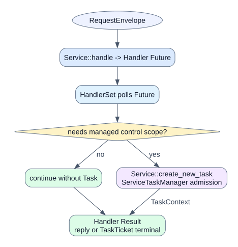
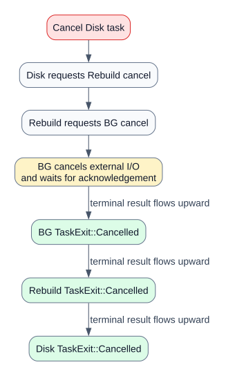

# 设计说明

## 1. 最终所有权

```text
Service = 核心元数据 + Router + ServiceTaskManager + async handle/workflow
Executor = 业务通道 + 控制通道 + HandlerSet + 唯一 poll 循环
Handler Future = 一次请求的执行主体
Task = Handler 内可选的准入/取消/观测作用域
Router = ServiceKey -> 类型化 ServiceClient + RequestContext 传播
```

没有 HandlerRegistry、TaskSpec、Future factory、Effect 或 Directive，也没有每业务一个 Tokio spawn。


## 2. 请求执行

```text
RequestEnvelope
    -> Executor 调用 Service::handle
    -> HandlerSet 保存并 poll 返回的 Future
    -> Future 直接返回 Result<Response, Error>
    -> Executor 完成 oneshot 或 TaskTicket
```

所有请求都会形成内部 Handler Future。只有业务显式调用 `Service::create_new_task` 时才形成可观测、可取消、可排重的 Task。



## 3. ServiceTaskManager

每个 Service 实例持有自己的 Manager：

```text
ServiceTaskManager
├── running: TaskId -> RunningTask
├── by_key: TaskKey -> TaskId
├── pending: TaskKey -> PendingTask
├── request -> Task 映射
├── CancellationScope
├── watch snapshots
└── broadcast events
```

Executor 不持有 Task，也不 poll Task Future。它只在以下通用边界调用 Manager：

- 控制通道取消指定 Task；
- Handler 返回时通知请求终态；
- Immediate Shutdown 时清理全部 Task 状态；
- 读取数量用于 Idle/Busy 与状态快照。

Task 的创建时机、TaskKey 和 ConflictPolicy 由 Service 工作流决定。Service 可以覆写 `create_new_task` 实现模块特有策略，公共 Manager 负责不值得重复实现的机械能力。

## 4. RequestContext 与传播

```text
RequestContext
├── request_id
├── operation_id
├── trace
└── task: Option<TaskRef>
```

`TaskRef` 是附加到请求的传播信息，不是通信句柄。Router 使用它建立父子 trace 和取消链；Task 本身不知道下游 Service。

本地 Router 使用 mpsc + oneshot 和 CancellationToken。未来 RPC Router 可以把 operation/task/parent 标识放入线协议，并将取消转换为显式 RPC。

## 5. 结构化取消



```text
控制信号：Disk TaskManager -> Disk TaskRef -> Router -> Rebuild -> BG
终态确认：Disk Handler <- Rebuild Handler <- BG Handler <- external I/O
```

正常取消只触发 CancellationScope。Handler Future 继续被 Executor poll，从而能够等待下游和外部 I/O 返回终态。取消完成后，Handler 的业务错误被统一映射为 `TaskExit::Cancelled`。

## 6. 同对象串行

```text
Running(old)
    │ Replace(new)
    ├── old -> Cancelling
    └── new -> Queued；new Handler 在 create_new_task().await 处挂起

old Handler -> terminal
    └── new -> Running；唤醒 new Handler
```

准入等待是 Handler Future 自身的 Pending，不产生新的 Tokio Task。旧 Handler 完整退出前，新 Handler 不会越过 Task 申请点。

## 7. 生命周期与清理

- `Pause`：停止接收新业务，继续 poll 在途 Handler；
- `Drain`：处理已入队请求并等待全部 Handler 返回，然后 Paused；
- `Graceful Shutdown`：Drain 后停止；
- `Immediate Shutdown`：abort 全部 Handler Future，并清理 TaskManager；
- Drop `ServiceGroup`：abort 唯一 Service 宿主 Tokio Task，宿主内的全部 Handler Future 随之 drop。

Service 状态同时报告：

- `queued_requests`：尚未进入 HandlerSet 的请求；
- `inflight_requests`：正在被 poll 的 Handler Future；
- `managed_tasks`：ServiceTaskManager 中的 Running/Queued Task。

## 8. 代码导航

```text
service/mod.rs          Service trait 与 create_new_task 抽象
service/client.rs       call/submit/send、TaskTicket
service/control.rs      生命周期与 Task 取消控制
service/group.rs        Pool 级 Service 容器
executor/runtime.rs     唯一 select/poll 循环
executor/handler_set.rs Handler Future 索引、poll 与硬终止
task/                   Manager、Context、Task policy
router.rs               类型化路由、上下文和取消传播
demo/disk_service.rs    Query、Offline、Fault Replace
demo/rebuild_service.rs 中游 Service 自治任务
demo/bg_service.rs      下游 Service 与末端 I/O
```

自动化测试覆盖 Query 零 Task、无 Task 长 Handler 的统一清理、三级取消等待、同对象替换串行和服务生命周期。
