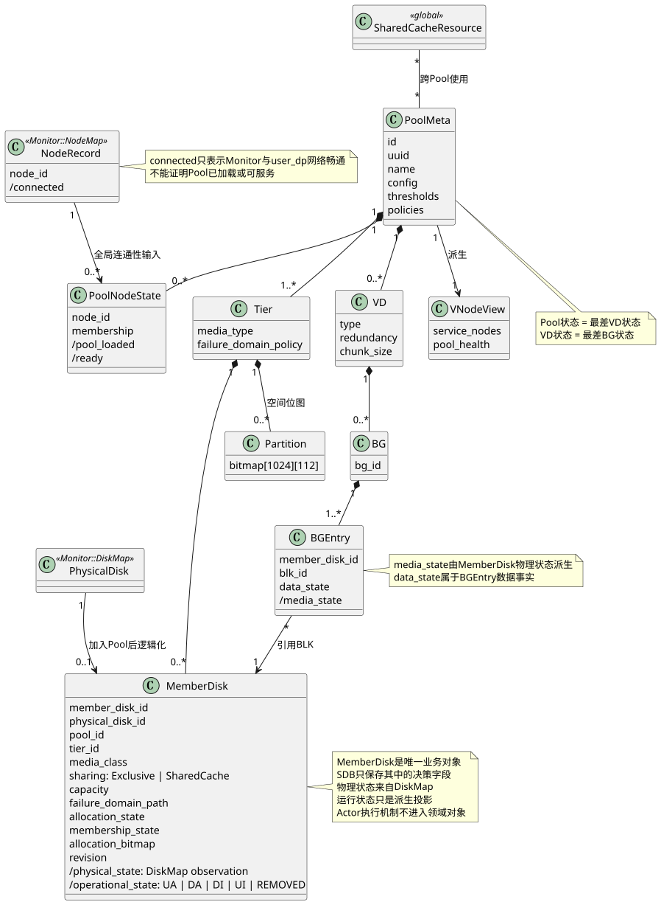

# 领域数据模型

## Pool 总体模型

一个 Pool 在时刻 \(t\) 的逻辑模型表示为：

\[
P(t)=(C,T,M,V,B,N,Q)
\]

- \(C\)：Pool 核心配置；
- \(T\)：Tier 与故障域拓扑；
- \(M\)：MemberDisk 集合；
- \(V\)：VD 集合；
- \(B\)：BG 集合；
- \(N\)：Pool 成员 Node；
- \(Q\)：VNODE 服务视图。

Operation Context、Task Attempt 和 Trace 是围绕业务状态建立的执行与观测投影，不作为与领域对象并列的核心元数据集合。



图源：[domain-model.puml](diagrams/domain-model.puml)

## Pool Core

Pool Core 只保存 Pool 自身配置，不承载全部子对象：

```rust
struct PoolMeta {
    id: PoolId,
    uuid: PoolUuid,
    name: PoolName,
    config: PoolConfig,
    thresholds: PoolThresholds,
    policies: PoolPolicies,
}
```

Pool 状态是派生结果，不应被建模成一个可以脱离 VD 状态随意修改的孤立字段。是否为查询性能保存状态缓存，后续再决定。

## Tier、拓扑与 MemberDisk

MemberDisk 是 Monitor 全局 DiskMap 中的物理盘在 Pool 内的逻辑化表示：

```rust
struct MemberDiskMeta {
    id: MemberDiskId,
    physical_disk_id: PhysicalDiskId,
    uuid: DiskUuid,
    capacity: Bytes,
    tier_id: TierId,
    topology: FailureDomainPath,
    state: MemberDiskState,
}
```

物理可访问性和空间分配能力是可分析、可查询的投影；实现模型不必把所有维度做笛卡尔积。当前用于验证架构的复合状态示例为：

```rust
enum MemberDiskState {
    UpActive,       // UA
    DownActive,     // DA
    DownInactive,   // DI
    UpInactive,     // UI
    Removed,
}
```

它只表达合法组合。`DownActive` 中的 `Active` 表示盘恢复后可直接回到可分配稳态，不表示系统可以向 DOWN 盘实际分配：

\[
Allocatable(m)=PhysicalUp(m)\land AllocationActive(m)
\]

`DI` 和 `UI` 都表示禁止新分配且正在处理排空；二者可以随物理事实互相转换。`DA -> DI` 本身不是不可逆承诺，排空可以协作停止并回到 `DA` 或 `UA`。已提交的单个 BG remap 不要求回滚。完整枚举、持久化方式以及 `REMOVED` 表示终态还是对象消失，留给 MemberDisk 专项设计确认。

介质和故障域映射：

\[
tier:M\rightarrow T
\]

\[
domain_l:M\rightarrow FailureDomain_l
\]

其中 \(l\) 可以表示 Node、Rack、磁盘柜等故障域级别。

## BLK 与 Partition

BLK 空间粒度：

\[
unit(m)=
\begin{cases}
1GiB,&capacity(m)\leq 8TiB\\
2GiB,&capacity(m)>8TiB
\end{cases}
\]

Partition 是位图元数据的组织方式。当前已知结构近似为：

```rust
struct DiskBlks {
    bitmap: [u8; 14], // 112 bits
}

struct Partition {
    blks: [DiskBlks; 1024],
}
```

可以抽象为：

\[
Partition_k\in\{0,1\}^{1024\times112}
\]

该结构属于 Tier/MemberDisk 的空间分配数据，不改变 Pool 的顶层领域边界。磁盘槽位稳定性、Partition 跨 Tier 关系以及并行更新机制均为后续专项设计。

## VD 类型

\[
VDType\in\{
DPOOL,
META\_VOL,
WAL\_LOG\_VOL,
LOG\_VOL,
SSD\_CACHE,
PERFORMANCE
\}
\]

已知业务语义：

| VD 类型 | 用途与冗余基线 |
| --- | --- |
| DPOOL | 用户数据，冗余策略由用户配置 |
| META_VOL | 元数据，默认三副本 |
| WAL_LOG_VOL | WAL 日志介质，详细策略待补充 |
| LOG_VOL | 日志介质，详细策略待补充 |
| SSD_CACHE | 读缓存，详细策略待补充 |
| PERFORMANCE | 分级存储池中的性能层，冗余策略由用户配置 |

每个 VD 至少包含：

```rust
struct VdMeta {
    id: VdId,
    pool_id: PoolId,
    vd_type: VdType,
    redundancy: RedundancyPolicy,
    chunk_size: ChunkSize,
    bg_map: PagedBgMap,
}
```

## BG 与 BGEntry

BG 是 VD 的 Chunk 和空间分配单元：

\[
owner:B\rightarrow V
\]

\[
entries:B\rightarrow List(BGEntry)
\]

```rust
struct BgEntry {
    member_disk_id: MemberDiskId,
    blk_id: BlkId,
    data_state: EntryDataState,
}
```

BGEntry 的介质状态不必重复成为独立权威字段，而是由引用的 MemberDisk 派生：

\[
MediaState(e,t)=PhysicalProjection(MemberDiskState(MemberDisk(e),t))
\]

数据状态：

\[
DataState(e)\in\{VALID,INVALID\}
\]

可直接提供有效数据的条件：

\[
Usable(e)=MediaUp(e)\land DataValid(e)
\]

## NodeMap、PoolNodeState 与 VNODE

Monitor 全局 NodeMap 表达与 user_dp 的网络连通性：

\[
Connected:NodeId\rightarrow \{true,false\}
\]

Pool 单独拥有成员 Node 集合以及每个成员上的 Pool 服务状态：

\[
Members(P)\subseteq Nodes
\]

\[
PoolServiceState_P:Members(P)\rightarrow State
\]

当前可服务节点既不等于成员集合，也不能由 NodeMap 连通性单独决定：

\[
Serving(P,t)=\{n\in Members(P)\mid Connected(n,t)\land PoolReady(P,n,t)\}
\]

这里的 `PoolReady` 是 Pool 在该 user_dp 上的服务状态，完整状态枚举尚未确定。

VNODE 使用服务节点和 Pool 状态建立计算资源分片与 DHT 寻址视图：

\[
Placement_P:VNODE(P)\rightarrow Serving(P)
\]

VNODE 的具体映射算法属于 IO 流和数据面设计，不进入当前 Pool 管控面基线。

## 共享缓存层

普通 MemberDisk 是 Pool 私有资源；共享缓存层是 DiskMap 与多个 Pool 之间的跨 Pool 资源关系：

```text
SharedCacheResource * <-> * Pool
```

因此共享缓存不能直接作为普通 `Pool -> MemberDisk` 一对多关系的特例字段处理。它需要独立的全局资源标识、使用关系和状态传播模型，具体数据结构待后续专题确定。
