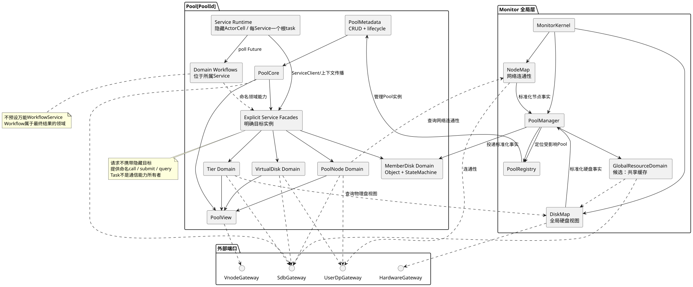

# Monitor 管控面架构

## 架构目标

- 以 Pool 作为主要隔离和管理边界；
- 让领域数据的所有者清晰，不把全部元数据放进一个共享大对象；
- 让 SDB 决策、外部事实、派生状态和运行操作彼此可区分；
- 可靠性优先，执行模型不能破坏领域不变量；
- 后续开发者主要编写业务能力和工作流，而不是理解复杂框架机制；
- 为未来并行执行或进程拆分保留显式接口，但不提前引入分布式复杂度。

## 组件视图



图源：[control-plane-components.puml](diagrams/control-plane-components.puml)

## Monitor 全局层

### MonitorKernel

职责：

- Active/Standby 角色感知；
- Monitor 启停和全局生命周期；
- 外部请求和事件入口；
- 基础设施 Gateway 装配；
- 启动 PoolManager。

### PoolManager

职责：

- 从 SDB 枚举和加载 Pool；
- 创建、恢复、卸载独立 `Pool`；
- 维护 `PoolRegistry`；
- 将 Pool 级请求和事件路由到目标 Pool；
- 协调真正跨 Pool 的能力。

`PoolManager` 不应直接实现 Tier、VD 或 BG 的业务规则。

### DiskMap（DDM）

DiskMap 是 Monitor 全局组件，管理物理硬盘视图并向各 Pool 提供硬盘身份、容量、介质和物理状态。外部硬盘拓扑变化由 DiskMap 标准化后通知受影响的 Pool。Pool 模块只消费其能力，不设计 DiskMap 内部的硬盘管理流程。

### NodeMap

NodeMap 是 Monitor 全局组件，只管理 Monitor 与 user_dp 的网络连通性。外部 Node 拓扑变化由 NodeMap 标准化后通知受影响的 Pool。它不保存某个 Pool 在 user_dp 上是否加载、Ready 或提供服务。

### 拓扑事实路由

`PoolManager` 接收 DiskMap 和 NodeMap 的标准化通知，根据 Pool 归属和成员关系投递给受影响的 Pool。普通盘使用 `Exclusive` 归属并且只能有一个目标；只有显式标记为 `SharedCache` 的资源才可以拥有多个目标。两种模式不得在同一物理盘上混用。

它只负责事实路由，不决定磁盘重建、Node 加载或 VNODE 迁移等业务策略。

### GlobalResourceDomain

该组件目前是候选边界，用于容纳真正跨 Pool 的资源关系，例如共享缓存层。

普通硬盘通过 Monitor 内的 DiskMap 接入，并由单个 Pool 独占。只有无法归入单 Pool 的业务事实才进入全局资源域，避免把 DiskMap 的硬盘管理能力复制进 Pool 模块。

## Pool

`Pool` 是单个 Pool 在 Monitor 内的业务对象、生命周期和装配边界：

```text
Pool
├── PoolMetadata / Pool CRUD
├── PoolCore
├── MemberDiskDomain / TierDomain
├── VirtualDiskDomain
├── PoolNodeDomain
├── Domain Workflows（分别定义在所属Service）
├── 显式领域 Service Facade
├── 每 Service 内部的通用 Runtime
├── PoolView
└── Reconcile
```

`Pool` 不叫 `PoolRuntime`：前者是业务概念，后者只是可复用的执行机制。当前每个领域 Service 一个根 task；Runtime 内部的虚拟 ActorCell 不额外创建 task。

### PoolCore

- Pool 基础配置、阈值和策略；
- Pool 生命周期的领域状态；
- 汇总派生状态；
- 提供 Pool 级只读视图。

PoolCore 不直接拥有全部 MemberDisk、VD 和 BG 数据。

### TierDomain

- Tier 和故障域拓扑；
- MemberDisk 的 Pool 内逻辑信息；
- BLK 空间位图；
- 空间选择、分配和释放能力；
- Partition 元数据管理。

### VdDomain

- VD 类型、冗余策略和 ChunkSize；
- BG 与 BGMap；
- BGEntry 数据有效性；
- BG、VD 健康状态计算。

当前不决定是一个 `VdDomain` 管理全部 VD，还是每个 VD 使用独立运行单元。

### NodeDomain

- Pool 成员节点；
- Pool 在各 user_dp 上的加载和服务状态；
- 将 NodeMap 连通性作为外部输入，而不是 Pool 服务状态；
- 当前可服务节点集合；
- Pool 加载/卸载能力；
- 向 VNODE 视图提供输入。

### Domain Workflows

跨领域长操作必然存在，但不建立万能 WorkflowService，也不让 Operation 成为第二套业务状态机。后续逐个场景判断：

- 操作由哪个领域发起和拥有；
- 哪些中间状态属于核心元数据；
- 哪些步骤需要调用其他领域能力；
- 工作流如何协作取消、恢复和审计；
- 是否值得抽取公共执行机制。

Workflow 优先实现为所属 Service 上的自然 `async fn`。Operation Context 只传播因果、取消和 Trace；决定流程走向的事实必须保存在领域对象中。

### Service Runtime 与显式领域能力

公共基础设施包括：

- 独立的控制通道与业务通道；
- 请求到 Service 方法的静态分发；
- 私有 ActorCell，根据状态机声明的目标 Workflow 执行互斥、合并、协作替换、排队和限流；
- 统一 poll Workflow Future，并维护 Task Attempt 父子关系；
- Service 的 Pause、Resume、Drain、Stop 生命周期；
- Idle/Busy、队列、阻塞、进度和 Trace 观测；
- 强制停止根执行单元前的结构化取消与收敛。

`ServiceClient<R>` 是指向一个明确 Service 实例的类型化地址，内部封装 channel、oneshot 和 Operation Context 传播。请求类型本身不声明目的地，也不存在依据请求枚举自动选择服务的全局 Router。

领域模块在 `ServiceClient` 外提供命名 facade，例如：

```rust
self.pool_nodes.publish_member_disk(&context, disk, Down).await?;
self.virtual_disks.evacuate_member_disk(&context, disk).await?;
```

命令枚举、响应枚举、channel 和 oneshot 对领域外部不可见。业务代码不通过 Task 发起跨服务通信，也不直接管理 `JoinHandle`。

### MemberDisk 对象与隐藏 ActorCell

- `MemberDisk` 是唯一领域对象：直接拥有持久化决策字段与最新 DiskMap 观测，不再拆出 Record/Snapshot；
- 纯状态机只根据对象投影和事件返回 `Transition::to(...).change(...).ensure(Workflow)`；对象负责应用 `change` 并校验最终投影；
- `ActorCell` 是 Runtime 私有执行状态，拥有当前意图、订阅者、替代意图和等待队列；
- 相同目标 Workflow 自动合并，不同目标 Workflow 自动协作替换；
- 普通领域代码不感知 ActorCell，也不为每盘创建 Tokio task/mailbox。

因此逻辑上的 MemberDisk Actor 是 `MemberDisk` 与同一 `ObjectKey` 下私有 `ActorCell` 的组合。前者是长期业务真相，后者是按需出现、空闲即消失的动态执行载体；二者没有重复状态。

### PoolView

向外提供稳定、只读、聚合后的 Pool 视图，避免调用者直接读取多个领域内部对象并自行拼接状态。

## 业务观测平面

业务观测不能只依赖日志或运行时 Span。候选观测平面包含：

```text
OperationJournal
CausalJournal
ServiceSnapshotHub
RuntimeTraceAdapter
```

- `OperationJournal` 追加开始、里程碑、完成和结果事件，并投影当前活动；
- `CausalJournal` 保存 Event、Operation Context、状态转换及其多对多因果关系；
- `ServiceSnapshotHub` 聚合领域服务生命周期、队列、在途操作、阻塞原因和进度；
- `RuntimeTraceAdapter` 将 Task Attempt 映射到底层 Trace/Span，用于性能和代码级诊断。

TUI 查询的是结构化业务模型，而不是解析日志文本。业务因果图允许一个 BG 重建同时关联多个磁盘故障，不能被限制为严格父子树。

## 领域编排所有权

跨领域流程由“最终业务结果”的领域所有者负责。例如硬盘隔离 Workflow 属于 DiskDomain；DiskDomain 调用：

```text
VdDomain.evacuate_member_disk(...)
NodeDomain.publish_member_disk_state(...)
```

VdDomain 自治完成受影响 BG 的识别、合并和重建，NodeDomain 自治完成可服务 user_dp 的选择与同步。DiskDomain 不访问它们的元数据，也不展开它们的内部步骤。

这是一种有明确所有者的领域编排，不是全局万能 WorkflowService，也不是无人汇总结果的纯事件 choreography。OperationId 可以贯穿整条因果链，但不会替代 MemberDisk、VD、BG 等领域状态。

## 基础设施端口

Monitor 通过显式接口访问外部系统：

```text
SdbGateway
HardwareGateway
UserDpGateway
VnodeGateway
```

领域服务不应依赖外部系统的具体客户端类型。未来即使改为 RPC 或拆分进程，上层语义仍可以保持为 `call/submit/query`。

## 建议依赖方向

如果进入代码实现，依赖方向保持：

```text
Types -> Config -> Repository/Ports -> Domain Service -> Runtime -> Interface
```

- Types 定义 Pool、Tier、MemberDisk、VD、BG、Node 等值对象和协议；
- Repository/Ports 定义 SDB、硬件事件、user_dp、VNODE 接口；
- Domain Service 实现领域规则；
- Pool 装配领域 Service；Runtime 在每个 Service 内提供执行和生命周期机制；
- Interface 处理外部 API、事件和观测输出。

## 已明确的实现约束与仍待原型验证的判断

已明确的实现约束：

- 普通业务代码使用自然 `async fn` 编排，不创建 `TaskSpec` 或包装执行主体的闭包；
- Query 不被强制包装为可观测 Task；
- Task、Future 集合、channel、oneshot、取消传播和 Trace 由框架管理；
- 业务与控制通道语义分离，控制消息具有独立准入和优先处理能力；
- 跨服务通信属于显式 Service facade/Client，不属于 Task；
- 核心元数据只能由所属 Service 修改，且不得把可变访问跨过 `.await`。

已经由当前纵切面验证：

- `PoolManager -> Pool -> Domain Service` 的多 Pool 装配与路由；
- 每 Service 一个根 task，并使用 `FuturesUnordered` poll 多个 Workflow Future；
- `StateCell` 只允许同步闭包访问，无法把锁 Guard 跨过 `.await`；
- MemberDisk 对象/状态机与 Runtime 私有 ActorCell 的职责分离；
- 自然 `async fn` Workflow、显式领域 facade，以及替代意图等待旧 Future 稳定退出。

仍待验证的是 Tier/Partition 并行化、完整 VD/BG 恢复语义和真实 SDB 条件写适配器，而不是重新引入隐藏路由或每对象 task。
