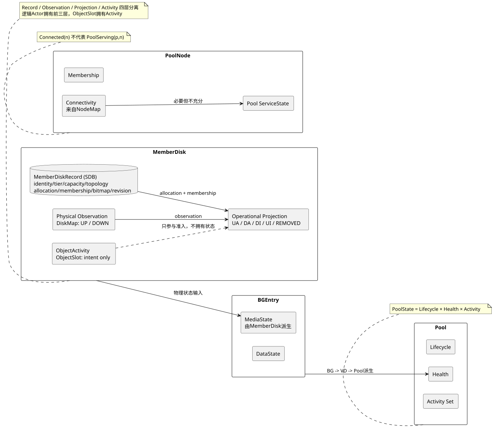
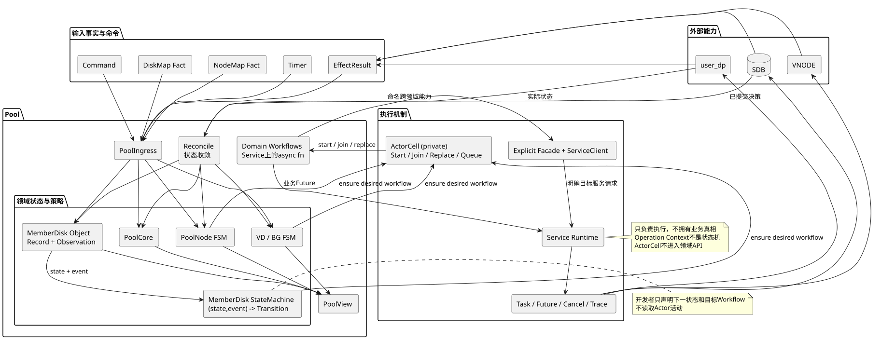
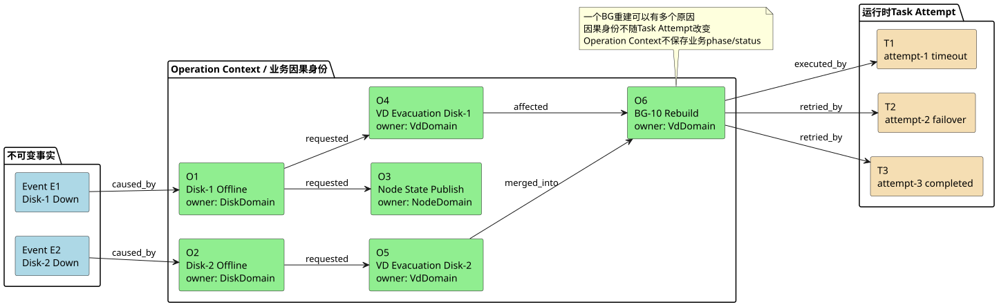
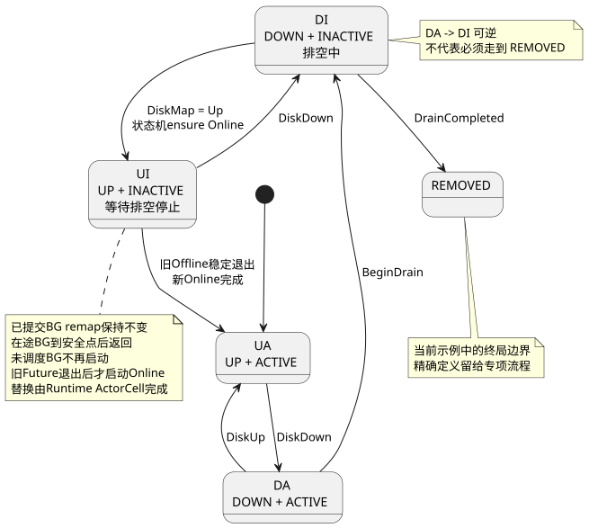
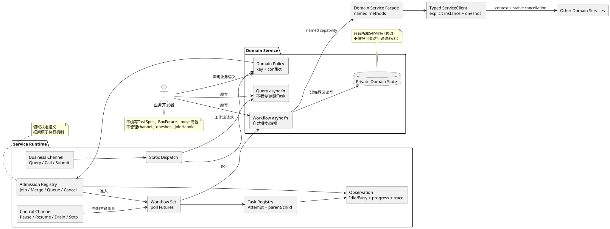

# 面向中心化存储管控面的对象状态机、领域工作流与收敛控制混合模型

副标题：Pool 管控面业务架构的形式化基础

版本：`Working Paper B0.2`

日期：2026-08-29

文档性质：内部架构立场论文，未经同行评审；用于统一理论语言、约束后续设计，不替代具体功能规格和验证。

## 摘要

本文研究一个中心化 Monitor 管理多个分布式存储 Pool 时的业务建模问题。系统同时面对持久化决策、硬件事实、网络连通性、数据面实际状态、派生健康状态以及长时间运行操作；SDB 不提供覆盖全部领域数据的业务事务，Monitor 采用冷备并在切主后重建内存，Pool 内部还存在同一对象并发事件、跨对象合并、异步取消和最终收敛等要求。

本文提出一种混合模型：以 Pool 作为隔离边界，以领域对象状态机作为业务真相和冲突判断核心，以领域服务管理元数据所有权，以定义在领域服务上的自然 `async` 工作流表达跨领域过程，以 Reconcile 处理现实与决策的偏差，以轻量运行时统一提供通信、准入、Future 驱动、协作取消和观测能力。Operation 只承担一次业务影响的稳定因果身份，不再定义独立业务状态机。该模型拒绝纯工作流中心、巨型 Pool 状态机、Operation 双重状态机以及将每个对象机械映射为独立微服务四种极端方案。

本文给出状态空间、输入输出、冲突关系和安全不变量的形式化定义，并论证 `BG引用集合 ⊆ 已分配BLK集合`、NodeMap 连通性与 Pool 服务状态分离、工作流内存不可成为核心事实源等关键命题。结论是：Pool 管控面应被实现为 Monitor 内的模块化控制系统，而不是通用工作流引擎；业务开发者主要表达对象状态、领域策略和自然工作流，通用框架只负责执行机制。

关键词：存储控制面；对象状态机；领域工作流；结构化并发；Reconcile；Actor；Saga；安全不变量；最终收敛

### 论证边界

本文区分三种结论：系统前提是已经确认的业务事实；架构原则是后续实现不得绕开的约束；MemberDisk 状态迁移和 Service Runtime 结构属于用于检验原则的工作示例或候选实现。示例用于建立共同语言，不替代后续逐流程规格、失败矩阵和验证。

## 1. 研究问题

Pool 管控面需要同时回答五类问题：

1. **事实问题：** 硬盘、Node、user_dp 和数据现在真实处于什么状态；
2. **决策问题：** 系统已经正式接受了哪些 Pool、空间和 BG 元数据决策；
3. **派生问题：** BG、VD、Pool 当前健康状态是什么；
4. **过程问题：** 创建、加载、重建、迁移等操作执行到哪一步；
5. **执行问题：** 如何并发驱动、暂停、取消、跟踪这些异步操作。

如果把五类问题放进同一个工作流或 Scheduler，业务语义将被执行细节吞没；如果全部放进一个 Pool 大对象，代码又会失去局部所有权和演进能力。

本文研究的核心问题是：

> 如何在不牺牲可靠性的前提下，让 Pool 业务状态、跨领域流程和异步执行机制彼此分离，同时仍能形成一个开发者容易理解的整体？

## 2. 已确认的系统前提

本文只以当前基线中已经确认的事实为前提。

### 2.1 中心化 Monitor

同一时刻由一个 Active Monitor 管理全部 Pool。备 Monitor 冷备，切主后从 SDB 和外部事实重新构造内存。

### 2.2 Monitor 内部的全局 Map

- DiskMap（DDM）管理全局物理硬盘视图；
- NodeMap 管理 Monitor 与 user_dp 的网络连通性；
- 磁盘和节点的外部拓扑变化分别由两个 Map 标准化后通知 Pool；
- NodeMap 连通不表示某个 Pool 已在 user_dp 上加载或可服务。

### 2.3 Pool 的分域元数据

Pool Core、Tier/MemberDisk、VD/BG、PoolNode 等数据分散存储，并非一个整体 Key。重要决策以 SDB 成功落地为准。

### 2.4 无跨领域业务事务

SDB 不提供覆盖 Tier 位图与 VD/BGMap 的统一事务或业务 WAL。系统优先保证数据安全，允许可恢复的容量泄露，不允许 BLK 重复分配和有效数据覆盖。

### 2.5 数据面实际状态独立存在

SDB、Monitor 内存以及 user_dp/硬件实际状态可能短暂不一致。Monitor 必须能够识别差异并最终收敛。

完整业务事实见[领域数据模型](02-domain-data-model.md)和[状态与权威来源](03-state-and-authority.md)。

## 3. 理论来源及其适用边界

### 3.1 Reactive System 与 Statecharts

Harel 将持续响应外部和内部刺激的系统称为 reactive system，并通过层次、正交状态和通信扩展传统状态机。Pool 管控面显然属于此类系统：它没有一次性输入和最终终止点，而是持续接收 DiskMap、NodeMap、API、Timer 和 user_dp 结果。[Statecharts 原始论文](https://doi.org/10.1016/0167-6423(87)90035-9)为本文采用“对象状态机”和“状态投影”提供理论依据。

本文不要求代码必须使用某个 Statechart 框架。Statechart 在这里首先是一种业务分析语言。分析时可以把一个状态投影为物理、分配、成员等维度；实现时则可以使用只枚举合法组合的复合状态，避免乘积空间产生非法组合。

### 3.2 Actor 的状态所有权

Actor 模型强调封装状态、通过消息交互以及并发实体之间的隔离。[Hewitt、Bishop 和 Steiger 的原始 Actor 论文](https://www.ijcai.org/Proceedings/73/Papers/027B.pdf)为“服务拥有自己的核心状态、外部通过显式通信句柄访问”提供理论支撑。

本文采用 Actor 的隔离与串行消息思想，但不把 Actor 作为领域编程接口。MemberDisk 只是拥有完整 Record 与最新 DiskMap 观测的领域对象；状态机只是纯函数。对象级串行化、订阅者和在途 Workflow 由 Runtime 私有 `ActorCell` 管理，全部 ActorCell 由 MemberDisk Service 的一个根执行单元驱动，不为每盘创建 Tokio task 或 mailbox。对象粒度来自业务并发边界，task 粒度来自运行时机制，二者不是一一对应关系。

### 3.3 Saga、Process Manager 与自然工作流

[Garcia-Molina 和 Salem 的 Saga 论文](https://doi.org/10.1145/38713.38742)将长事务拆成可交错执行的局部事务，并在失败时通过补偿动作修正部分执行。这为 Pool 的跨领域长操作提供了过程分解语言。

但 Pool 不能照搬“失败即补偿”：当 VD 的 BGMap 提交结果不确定时，盲目释放已经分配的 BLK 可能破坏数据安全。因此本文吸收 Process Manager 的过程所有权和分阶段思想，但不要求额外建立一个带 `phase/status` 的过程状态机。业务流程优先写成领域服务上的自然 `async fn`；需要恢复的正确性事实必须写入领域元数据，不能只留在 Workflow 栈或 Operation 记录中。补偿也必须受领域不变量约束；无法证明安全时，宁可保留资源泄露。

### 3.4 Controller 与 Reconcile

Kubernetes 官方将 Controller 描述为持续观察当前状态并使其接近期望状态的控制循环，同时建议使用多个职责清晰的 Controller，而不是一个相互耦合的巨型循环。[Kubernetes Controller 模式](https://kubernetes.io/docs/concepts/architecture/controller/)为本文的 Reconcile 层提供工程参照。

本文不把所有业务都改写为无过程的声明式控制器。需要严格顺序、外部等待和明确完成语义的操作仍使用自然工作流；Reconcile 用于恢复偏差和保证收敛。

### 3.5 Safety、Liveness 与协调边界

并发系统可分别讨论安全性——坏事永不发生，以及活性——好事最终发生。[Lamport 关于活性证明的工作](https://lamport.azurewebsites.net/pubs/liveness.pdf)为本文区分安全不变量和进度目标提供基础。

[CALM 理论](https://arxiv.org/abs/1901.01930)指出，单调逻辑更容易获得无需协调的一致实现。Pool 的“增加已分配标记”在特定阶段具有单调性，而释放、替换和复用属于非单调操作，需要串行化、版本条件或等价协调。这为“首阶段 Tier 内串行，后续只在可证明安全的边界并行”提供理论解释。

## 4. 系统形式化模型

### 4.1 Monitor

定义 Monitor：

\[
\mathcal{M}=(Role,DiskMap,NodeMap,Registry,Gateways,\{P_i\})
\]

其中：

\[
Registry:PoolId\rightarrow Pool
\]

DiskMap 和 NodeMap 是全局事实视图；`PoolManager` 维护 Registry 并路由事实；`Pool` 是单 Pool 的业务、内存和生命周期隔离边界。通用 Runtime 只存在于每个领域 Service 内部，不能代替 Pool 业务对象。

### 4.2 Pool 状态

\[
S_P=
S_{core}
\oplus S_{tier}
\oplus S_{vd}
\oplus S_{node}
\]

- \(S_{core}\)：Pool 配置、阈值、生命周期和聚合视图；
- \(S_{tier}\)：Tier、拓扑、MemberDisk 和空间位图；
- \(S_{vd}\)：VD、BG、BGEntry 和逻辑空间映射；
- \(S_{node}\)：Pool 成员节点及其 Pool 服务状态。

符号 \(\oplus\) 表示责任组合，不表示数据被序列化成一个对象。Operation、Task Attempt 和 Trace 属于执行与观测投影，不作为与领域状态并列的第五份业务真相。如果某个中间事实影响恢复正确性，它必须进入相应领域的持久化状态。

### 4.3 三份状态视图

\[
P=(P^{sdb},P^{mem},P^{real})
\]

\[
P^{mem}=Materialize(P^{sdb},DiskMap,NodeMap,Obs_{user\_dp})
\]

SDB 保存决策，Map 和 user_dp 提供现实，Monitor 内存是二者的工作投影。

### 4.4 输入集合

\[
Input_P=Command\cup TopologyFact\cup EffectResult\cup Timer
\]

- `Command`：调用者要求系统完成的业务目标；
- `TopologyFact`：DiskMap/NodeMap 标准化后的事实通知；
- `EffectResult`：SDB、user_dp、VNODE 等异步效果结果；
- `Timer`：恢复超时、重试、延迟策略等时间事实。

### 4.5 业务转移

对领域对象 \(o\)，其业务转移为：

\[
\delta_o:(State_o,Input)\rightarrow(State'_o,Decision,Intent,Reply)
\]

- `Decision`：需要成为正式元数据的状态变化；
- `Intent`：需要执行的外部或跨领域动作；
- `Reply`：本次请求是否立即完成，或返回一个可等待凭据。

该公式不要求业务代码写成巨型 reducer。自然的 `async fn` 可以实现同样语义，但必须保持状态所有权和提交边界清晰。

## 5. 分析维度与可执行状态



图源：[state-dimensions.puml](diagrams/state-dimensions.puml)

### 5.1 Pool

\[
PoolState=Lifecycle\times Health\times Activity
\]

- `Lifecycle`：Pool 是否正在加载、可接收请求、排空或卸载；
- `Health`：由最差 VD 派生；
- `Activity`：当前重建、迁移、扩缩容等操作集合。

健康、生命周期和活动不能压缩进一个枚举，否则会产生大量无意义组合状态。

### 5.2 MemberDisk

MemberDisk 不能被下面的状态枚举替代。它至少由四层信息组成：

```text
MemberDiskRecord(SDB decision)
  = identity + pool/tier + media/capacity + failure domains
  + allocation state + membership + BLK bitmap + revision
PhysicalState(DiskMap observation)
MemberDiskState = project(record, physical observation)
ActorCell activity = private Runtime execution intent
```

核心元数据只有 MemberDisk 领域可以修改；物理状态来自 DiskMap；UA/DA/DI/UI/Removed 是派生的运行投影；ActorCell activity 只表示 Runtime 私有的 Future 在途状态。四者不能混成一份状态，而且状态机不能读取 ActorCell activity。物理可访问性、空间分配能力和成员生命周期在分析上可以分别观察，而运行投影使用只包含合法组合的复合状态：

```rust
enum MemberDiskState {
    UpActive,       // UA：可提供 IO，可分配新空间
    DownActive,     // DA：物理不可达；若恢复，可直接回到 UA
    DownInactive,   // DI：物理不可达，禁止新分配，正在排空
    UpInactive,     // UI：物理已恢复，仍禁止分配，正在停止或继续排空
    Removed,        // 已解除成员关系
}
```

`Active` 不是“此刻一定能够分配”的充分条件。有效分配能力是状态投影：

\[
Allocatable(m)=PhysicalUp(m)\land AllocationActive(m)
\]

因此 `DA` 保留的是“恢复后可直接重新服务”的策略含义，而不是允许向一块 DOWN 盘实际分配空间。MemberDisk 状态机只对外部事实作出 `Transition::to(next).ensure(workflow)` 决定；Runtime 根据对象当前目标自动推导启动、同类合并或异类协作替换。状态图不持有 Actor、channel、Future、task 或锁。

### 5.3 PoolNode

\[
PoolNodeState=Membership\times Connectivity\times ServiceState
\]

Connectivity 来自 NodeMap；Membership 和 ServiceState 属于 Pool。

### 5.4 BGEntry

\[
BGEntryState=MediaState\times DataState
\]

介质重新 UP 不会自动把 INVALID 数据变回 VALID。

## 6. 混合业务模型



图源：[hybrid-control-model.puml](diagrams/hybrid-control-model.puml)

### 6.1 对象状态机：决定是否应该做

对象状态机负责：

- 校验输入与当前状态是否兼容；
- 识别过期、重复和冲突输入；
- 决定排序、互斥、合并、替换或拒绝；
- 更新对象业务状态；
- 产生明确的业务 Intent。

状态机是策略入口，但不负责通用 Future 调度。

### 6.2 领域服务：拥有状态与能力

候选领域所有权：

| 领域 | 核心所有权 |
| --- | --- |
| PoolCore | Pool 配置、生命周期、聚合视图 |
| TierDomain | Tier、故障域、MemberDisk、Partition/位图、空间能力 |
| VdDomain | VD、BG、BGMap、Entry 数据有效性、健康计算 |
| NodeDomain | Pool 成员关系、Pool 在 user_dp 上的服务状态、可服务节点视图 |

领域之间通过显式 `call/submit/query` 能力交互，不共享可任意修改的内部对象。

核心元数据采用唯一修改者约束。对元数据 \(x\)：

\[
Mutate(x,d)\Rightarrow d=Owner(x)
\]

“领域私有”只禁止外部修改，不禁止业务观察。每个领域应提供：

```text
Command/Call：请求领域完成一个业务能力
Query/Snapshot：返回不可变业务视图
DomainEvent：发布已经发生的状态变化
```

外部不得获得 `Arc<Mutex<DomainState>>`、`Arc<RwLock<...>>` 或内部对象的可变引用。否则领域方法不再是修改状态的唯一入口，任何并发、审计和恢复保证都会被绕开。

### 6.3 领域工作流：表达跨领域过程

出现以下特征时，应建立具名领域工作流：

- 跨多个领域；
- 有多个异步阶段；
- 需要等待 user_dp 或外部系统；
- 需要取消、恢复、审计或明确完成语义；
- 失败后不能简单从头重做。

工作流不是新的状态所有者，也不是第二套业务状态机。它是一个自然 `async fn`，读取和修改所属领域的核心状态，并通过明确目标实例的领域 Service facade 调用其他领域能力。工作流的所有者由最终业务结果决定：

\[
Owner(Workflow)=Owner(BusinessOutcome)
\]

例如，硬盘离线后的最终目标是把 MemberDisk 安全推进到下一个稳态，因此 `DiskDomain::offline_workflow` 属于 DiskDomain。DiskDomain 可以调用：

```text
VdDomain.evacuate_member_disk(disk, context)
NodeDomain.publish_member_disk_state(disk, state, context)
```

但它不能访问 VD/Node 元数据，也不能展开 `find_bg -> remap -> rebuild -> commit_bg` 等 VdDomain 内部步骤。VdDomain 自治完成 BG 识别、多个磁盘需求合并和重建；NodeDomain 自治选择可服务 user_dp 并完成状态同步。

这形成“父领域拥有最终结果、子领域拥有局部过程”的嵌套编排。相比纯事件 choreography，它有明确完成语义；相比全局 WorkflowService，它保留领域知识内聚。OperationId 可以贯穿调用链用于追踪，但 Operation 本身不持有决定流程走向的 `phase/status`。

### 6.4 Reconcile：恢复现实与决策的偏差

对领域 \(d\)：

\[
Reconcile_d(Committed_d,Observed_d)\rightarrow RepairPlan_d
\]

Reconcile 应以当前状态为输入并尽量保持幂等。它主要处理：

- Monitor 切主后的重新加载；
- 消息重复、丢失或顺序变化；
- SDB 已提交但 user_dp 尚未应用；
- user_dp 已执行但 Monitor 尚未确认；
- 历史资源泄露和状态偏差。

### 6.5 Runtime：只提供执行机制

通用运行时负责：

- 业务与控制消息；
- Future 驱动与并发上限；
- Task、取消、Trace 和审计；
- 服务生命周期；
- 观测快照。

运行时不决定 BG 是否重建、两个磁盘事件是否合并或 Node 恢复后是否加载 Pool。

## 7. Event、Workflow、Operation Context、Task Attempt 与 Future

### 7.1 五层概念

| 概念 | 回答的问题 | 生命周期 | 是否是核心事实 |
| --- | --- | --- | --- |
| Event | 发生了什么 | 不可变历史事实 | 是事实输入 |
| Workflow | 业务代码按什么顺序调用领域能力 | 一次自然异步流程 | 否 |
| Operation Context | 这次业务影响为何发生、属于谁、如何关联 | 跨调用、跨 Task Attempt | 否；是因果身份 |
| Task Attempt | Runtime 这一次如何驱动一个异步单元 | 一次运行尝试 | 否 |
| Future | 当前被 Runtime poll 的代码对象 | 内存级 | 否 |

关系为：

\[
Event\rightarrow OperationContext\rightarrow \mathcal{P}(TaskAttempt)
\]

\[
TaskAttempt\leftrightarrow Future_{runtime}
\]

一个 Operation Context 可以没有 Task，例如查询或被对象状态机立即吸收的重复请求；也可以关联多次 Task Attempt，例如超时重试或切主后的重新收敛。Workflow 是业务源码结构，不需要成为一个可持久化对象。

### 7.2 Operation 是因果上下文，不是业务状态机

最小运行上下文只携带调用链所需的信息：

```rust
struct OperationContext {
    operation_id: OperationId,
    owner_domain: DomainId,
    kind: OperationKind,
    scope: ObjectRef,
    causes: Set<CausalNodeId>,
    cancellation: CancellationScope,
    trace: TraceContext,
    progress: ProgressReporter,
}
```

`CancellationScope` 是唤醒和传播取消意图的运行机制，不是业务状态；`ProgressReporter` 产生观测事件，不决定下一步。Operation 的开始、里程碑、完成和结果可以形成追加式观测记录，`Running` 等展示状态由记录投影得出，而不是由业务代码维护另一套 `OperationStatus`。

如果一个中间阶段影响正确性且不能从 SDB、Map、user_dp 重新推导，它必须成为对应领域对象的持久化事实；不能把它塞进 Operation 观测记录充当隐形业务 WAL。由此保证：

\[
BusinessDecision = f(DomainState,Input),\quad BusinessDecision\neq f(OperationStatus)
\]

### 7.3 业务因果图



图源：[causal-operation-graph.puml](diagrams/causal-operation-graph.puml)

定义：

\[
CausalGraph=(V,E)
\]

节点集合至少包含：

\[
V=Event\cup OperationContext\cup TaskAttempt\cup StateTransition
\]

边表达：

```text
caused_by
requested
affected
blocked_by
merged_into
replaced_by
executed_by
```

业务因果关系必须是 DAG，而不是严格父子树。两个磁盘故障可以共同导致一个 BG 重建；一次重建也可能经历多个 Task Attempt。

[OpenTelemetry 规范](https://opentelemetry.io/docs/specs/otel/overview/)同样允许 Span 通过 Links 表达多来源、批处理和异步因果关系，这证明单父节点 Trace 树不足以覆盖全部现实关系。但本文的 CausalGraph 是持久化业务模型；OpenTelemetry Span 是执行遥测，两者通过标识关联而不相互替代。

### 7.4 实时与历史观测

业务观测平面至少提供四类视图：

```text
Pool Overview：生命周期、健康、当前活动
Domain View：队列、在途请求、当前工作流、阻塞原因
Object Timeline：对象状态转换及其原因
Causal Graph：一个事件对所有领域和对象的影响
```

服务实时快照可以通过 watch/broadcast 发布：

```rust
struct ServiceSnapshot {
    domain: DomainId,
    lifecycle: ServiceLifecycle,
    activity: IdleOrBusy,
    queued_requests: usize,
    active_workflows: Vec<WorkflowSummary>,
    blocked_on: Vec<DependencyRef>,
}
```

历史追溯依赖 OperationStarted/Finished、Milestone、CausalEdge 和 StateTransitionRecord 等追加式记录，而不是解析日志文本。Trace/Span 用于回答耗时、调用链和代码级等待；CausalGraph 用于回答为什么做、影响谁、合并到哪里以及最终改变了什么。观测记录可以丢失而降低可解释性，但不能因此改变领域决策。

### 7.5 何时建立 Operation Context 或 Task

建立可观测 Operation Context 的判断条件：

- 不能立即完成；
- 有多个业务阶段；
- 跨领域或等待外部系统；
- 运维需要查询进度和历史；
- 支持取消、审计或因果追踪；
- 失败后需要明确业务处置。

创建 Task Attempt 的判断条件：

- 当前阶段确实需要异步执行；
- 需要 Runtime poll、并发限制、取消、Trace 或资源计量。

因此 Query、只读 Snapshot、立即完成的状态判断和被状态机吸收的重复事件不需要可观测 Task。Task 不是请求进入系统后的强制包装，更不是业务开发者创建 Workflow 的语法前提。

## 8. 冲突、互斥与并行

为每个业务操作 \(o\) 定义影响集合：

\[
Footprint(o)\subseteq Objects(P)
\]

两个操作冲突，当且仅当它们影响相交对象且不可交换：

\[
Conflict(o_1,o_2)
\iff
Footprint(o_1)\cap Footprint(o_2)\neq\varnothing
\land
\neg Commute(o_1,o_2)
\]

由此得到分工：

- 领域状态机声明对象键、下一状态和目标 Workflow；
- Runtime 的私有 ActorCell 对同一对象固定执行“空闲则启动、同类则合并、异类则协作替换”，并维护等待者和并发配额；
- 普通串行写操作显式选择排队；不相交对象可以并行；
- 多对象影响集合、可交换合并等高级策略必须由专门协调领域建模，不能塞进普通开发者的状态机接口。

这个固定的 `ensure` 语义刻意减少策略 API。框架不猜测状态迁移，领域也不手写 `Start/Join/Replace` 或并发容器。若未来出现无法表达的真实反例，再为该协调领域增加受限扩展点，而不是预先暴露通用 Admission DSL。

固定语义成立的前提是 `(ObjectKey, WorkflowKind)` 完整表示一个可共享的收敛目标。相同 Kind 的参数若不可互换，就必须细化 Kind/Key 或使用顺序 `Enqueue`，否则自动 Join 会把不同业务错误地视为同一意图。

## 9. 业务取消与不可逆点

### 9.1 取消包含业务决定与运行时传播

取消请求首先是领域状态机收到的新业务输入：

\[
CancelRequested(ObjectRef,Cause)\in Input_P
\]

领域根据对象状态和已经提交的局部事实判断如何响应：

\[
CancelDecision(State_o,CommittedEffects,Cause)
\in\{Stop,SettleThenStop,Continue,Reject\}
\]

当领域决定停止时，Runtime 通过共享的 `CancellationScope` 唤醒整个调用链；父 Workflow 不直接 drop 子 Future。显式 Service Client 等待下游停止、完成当前不可中断动作或到达安全提交点并返回稳定结果，然后在控制权交回父 Workflow 前统一返回取消。跨模块通信由命名的领域 facade 提供，Task 不是 RPC 能力所有者。

不可逆性是局部提交属性，不是整个 Workflow 的全局开关。某个 BG remap 一旦正式提交便不回滚，但硬盘排空 Workflow 仍可以停止调度其余 BG。这种语义称为前向恢复：保留已经安全提交的成果，停止尚未开始或仍可停止的工作，再由对象状态决定新的稳态。

### 9.2 硬盘离线期间重新上线



图源：[disk-isolation-cancellation.puml](diagrams/disk-isolation-cancellation.puml)

当前示例状态迁移为：

```text
UA --DiskDown----------> DA
DA --DiskUp------------> UA
DA --BeginDrain--------> DI
DI --DiskUp------------> UI
UI --DiskDown----------> DI
DI --DrainCompleted----> REMOVED
UI --Offline稳定退出---> Online Workflow --OnlineSettled--> UA
```

其中 `DA -> DI` 不是不可逆承诺。`DI` 期间收到 `DiskUp` 后先进入 `UI`：物理盘已经恢复，但在途疏散尚未收敛，因此继续禁止新分配。DiskDomain 请求 VdDomain 停止继续调度新的 BG，并等待所有在途 BG 返回稳定结果；之后才从 `UI` 进入 `UA`。

已经完成并提交的 BG remap 保持原结果，不要求搬回旧盘；尚未开始的 BG 不再重建；正在执行的 BG 根据自己的局部提交边界停止或完成当前安全步骤。因此：

\[
WorkflowReversible\centernot\Rightarrow EveryCommittedEffectRollbackable
\]

`REMOVED` 是当前示例中的终局边界。精确迁移条件和 SDB 提交点仍需在 MemberDisk 专项流程中确认；本例只用于证明“对象状态机拥有业务真相、工作流协作取消、局部不可逆不等于整体不可取消”。

### 9.3 强制终止的边界

强制 abort 只用于服务停止、失控任务隔离或进程退出。它保证运行资源不会泄露，但不代表业务已经取消成功。下次启动必须通过领域对象状态、SDB、外部事实和 Reconcile 判断实际结果。

由于超时、重复通知、切主和不确定返回仍可能产生迟到结果，每个跨领域结果必须携带 OperationId 以及足够的对象版本或幂等标识，领域所有者依据当前对象状态拒绝已经不再适用的结果。

## 10. 核心安全命题

### 命题 1：有序持久化保持空间引用安全

令：

- \(A\)：Tier 位图中已分配 BLK 集合；
- \(R\)：已提交 BGMap 引用 BLK 集合。

安全不变量：

\[
R\subseteq A
\]

建立引用时先执行 \(A:=A\cup X\)，再执行 \(R:=R\cup X\)；解除引用时先执行 \(R:=R-X\)，再执行 \(A:=A-X\)。

**论证：** 对任意执行前缀，第一阶段失败最多产生 \(A-R\) 中的孤立分配；第二阶段尚未发生时不会产生 \(R-A\)。解除过程同理。因此任何单步失败都不会产生“BG 引用已释放 BLK”。该协议牺牲容量活性以保持数据安全。

### 命题 2：NodeMap 连通性不能替代 Pool 服务状态

\[
Connected(n)\centernot\Rightarrow PoolServing(p,n)
\]

因为 user_dp 网络畅通时，Pool 仍可能未加载、正在加载、已暂停或不可服务。因此可服务节点至少需要：

\[
Serving(P)=\{n\in Members(P)\mid Connected(n)\land PoolReady(P,n)\}
\]

### 命题 3：内存 Workflow 不能成为核心事实源

Monitor 冷备切主会丢失旧进程中的 Future。如果一个核心事实只存在于 Workflow 栈或闭包中，则新主无法从 SDB、Map 和 user_dp 重建等价状态，违反内存可重建原则。因此：

> 影响正确性且无法从现有事实推导的操作阶段，必须显式持久化；可重新推导的阶段不应为了框架统一而全部持久化。

### 命题 4：对象所有权可以局部化并发正确性

如果每个可变核心元数据只有一个领域所有者，所有修改都经其公开能力执行，则冲突检测和串行化可以限制在所有者内部。否则任何调用方都可能跨 `await` 修改共享状态，框架无法提供全局保证。

该命题支持领域服务拥有核心元数据，但不要求服务必须采用某种锁或 task 实现。

## 11. 拓扑事件语义

外部事实路径固定为：

\[
DiskEvent_{raw}\rightarrow DiskMap\rightarrow PoolTopologyFact
\]

\[
NodeEvent_{raw}\rightarrow NodeMap\rightarrow PoolTopologyFact
\]

Map 的职责：

- 维护全局对象身份和当前事实；
- 屏蔽外部事件格式；
- 产生标准化通知。

路由层的职责：

- 根据资源与 Pool 的使用关系找到受影响 Pool；
- 投递通知；
- 不替 Pool 作出业务决策。

Pool 的职责：

- 将事实交给对应对象状态机；
- 计算本 Pool 内影响；
- 产生业务 Intent 或更新派生状态。

普通盘对应单 Pool，共享缓存盘可能对应多个 Pool；NodeMap 自身不应因为路由方便而承担 Pool 服务状态。

## 12. 健康状态模型

BGEntry 可直接提供有效数据：

\[
Usable(e)=MediaUp(e)\land DataValid(e)
\]

BG 健康状态：

\[
Health(b)=Evaluate(Redundancy(owner(b)),UsableEntries(b))
\]

VD 与 Pool 聚合：

\[
Health(v)=Worst\{Health(b)\mid owner(b)=v\}
\]

\[
Health(P)=Worst\{Health(v)\mid v\in P\}
\]

健康状态是派生视图；生命周期和运行活动是独立维度。该分离避免“Pool 正在重建”与“Pool 是否健康”相互覆盖。

## 13. 恢复与最终收敛

Monitor 切主后的理论恢复函数：

\[
Recover(P)=Materialize(
SDB_P,
DiskMap,
NodeMap,
Observe_{user\_dp}(P)
)
\]

随后执行：

\[
Reconcile(P^{mem},P^{real})
\]

必须分别验证：

- **Safety：** 恢复期间不得释放仍被引用的 BLK、覆盖有效数据或把旧事实当成现实；
- **Liveness：** 在外部依赖最终可用且重试公平的条件下，已接受操作最终完成、明确失败或进入可人工处理状态。

本文不假设所有操作都能自动恢复；它要求每个具体流程明确自己的可恢复点和人工边界。

## 14. 对开发体验的约束

“Make dev easy”不是让框架替业务作决定，而是让业务开发者只表达那些无法由框架推导的领域语义。



图源：[service-runtime-contract.puml](diagrams/service-runtime-contract.puml)

### 14.1 普通开发者的编程表面

普通开发者首先编写纯状态机：

```rust
match (state, event) {
    (Ua, PhysicalDown) => Transition::to(Da).ensure(Offline),
    (Di, PhysicalUp) => Transition::to(Ui).ensure(Online),
    (Ua, PhysicalUp) => Transition::to(Ua),
    (Removed, PhysicalUp) => Transition::to(Removed).reject("explicit rejoin required"),
}
```

然后编写定义在领域 Service 上的自然 `async fn`：

```rust
impl MemberDiskWorker {
    async fn offline_workflow(
        &self,
        disk: MemberDiskId,
        context: WorkflowContext,
    ) -> RuntimeResult<MemberDiskSnapshot> {
        self.pool_nodes
            .publish_member_disk(&context, disk.clone(), Down)
            .await?;

        self.commit_progress(&context, &disk, DrainStarted).await?;

        self.virtual_disks
            .evacuate_member_disk(&context, disk.clone())
            .await?;

        self.commit_progress(&context, &disk, DrainCompleted).await?;
        self.snapshot(&disk)
    }
}
```

该代码是接口目标，不预先绑定具体宏名或 `StateCell` 实现。它确立以下约束：

1. Workflow 是 `self` 上的业务方法，不是注册表中的转发函数；
2. Query 可以直接执行，不被强制包装成可观测 Task；
3. 跨服务通信由目标领域的命名 facade 提供，不是 `task.call(...)`，也不是依据请求类型自动选路的 Router；
4. 业务代码不构造 `TaskSpec`、`BoxFuture` 或 `move |task| async move`；
5. Operation Context 作为附加上下文传播因果、取消和 Trace，不成为执行主体；
6. 元数据访问使用不暴露 Guard 的同步闭包，不能把可变借用或锁守卫带过 `.await`；
7. 普通 Workflow 不显式检查取消。Service Client 在下游稳定返回后统一传播取消，领域执行器只在自己的最小原子工作单元边界解释取消。
8. 普通开发者不读取 Actor 活动，也不选择 Start、Join 或 Replace。

### 14.2 策略声明与机制执行

业务状态迁移必须显式，但可推导的并发机制不应暴露给普通开发者。状态机只声明目标：

```rust
match (state, event) {
    (Ua, PhysicalDown) => Transition::to(Da).ensure(Offline),
    (Di, PhysicalUp) => Transition::to(Ui).ensure(Online),
    (Ua, PhysicalUp) => Transition::to(Ua),
}
```

框架负责原子准入、在途索引、订阅者、并发配额、协作取消和完成通知：对象空闲时启动，目标 Workflow 相同时合并，目标不同时协作替换。领域既不读取 Pending/Running/Replacement，也不管理 `HashMap<TaskKey, JoinHandle>`。普通对象写操作选择 `Enqueue`；真正的多对象协调由一个明确的协调领域实现。

### 14.3 Service Runtime 契约

每个 Service Runtime 对外表现为一个完整服务容器：

```text
Service Runtime
├── Control Channel：Pause / Resume / Drain / Stop
├── Business Channel：Query / Call / Submit
├── ActorCell Registry（私有）：互斥、合并、协作替换、排队、限流
├── Workflow Set：被统一 poll 的业务 Future
├── Task Registry：运行时执行尝试与父子关系
├── Domain State：仅本 Service 可修改
└── Observation：Idle/Busy、队列、阻塞、进度、Trace
```

当前原型已经采用“一个 Service 一个根 spawn task，由根任务 poll 多个 Workflow Future”。这仍是运行时实现而不是领域模型定理。它必须满足结构化并发：Service 停止接收请求后，先传播取消并等待子调用稳定收敛；超时才强制终止根执行单元，且任何遗留不一致由 Reconcile 处理。

### 14.4 Service Client 与领域 facade 契约

每个 `ServiceClient<R>` 指向创建它的那一个 Service 实例，负责：

- 封装业务通道和 oneshot；
- 继承 OperationId、Trace、取消作用域和因果边；
- 在调用方取消时通知下游，并等待下游返回稳定结果；
- 为未来进程拆分保留相同的 `call/submit/query` 语义。

`ServiceRequest` 不携带 `ServiceId`，不存在“把任意请求交给全局 Router 自动选择目标”的隐式行为。领域模块用 `MemberDiskService`、`VirtualDiskService` 等 facade 提供命名方法，并把命令/响应枚举留在模块内部。

Service Client 不负责判断业务冲突，也不拥有 Task。Task 只是 Runtime 对一次 Future 执行的内部记录。

### 14.5 框架隐藏与领域显式

框架应隐藏：

- channel 和 oneshot 样板；
- 请求到方法的分发表和 Future 集合轮询；
- Task 创建、父子关系、取消传播与生命周期；
- ActorCell、在途索引、等待者和并发配额；
- Start/Join/CancelThenStart 的机械选择；
- Trace、打点和服务观测；
- 服务停止时的 Future 清理。

框架不应隐藏：

- 业务提交顺序；
- 对象键、目标 Workflow 和高级多对象冲突关系；
- 数据安全不变量；
- 失败是否可补偿；
- 局部不可逆提交点；
- Workflow 的业务步骤和领域状态迁移。

### 14.6 切主恢复约束

框架不尝试序列化 Future 或恢复旧调用栈：

```text
加载 SDB 领域事实
    -> 重新观测 DiskMap / NodeMap / user_dp
    -> 重建领域对象
    -> 对非稳态对象执行 Reconcile
    -> 创建新的 Workflow / Task Attempt
```

因此自然 Workflow 可以保持简洁；正确性来自领域状态、幂等接口和 Reconcile，而不是运行时保存任意代码执行点。

## 15. 与三种候选极端模型的比较

| 模型 | 优点 | 主要问题 | 结论 |
| --- | --- | --- | --- |
| 纯工作流中心 | 顺序代码直观 | 对象并发、切主恢复和多流程冲突困难 | 不采用为核心模型 |
| 巨型 Pool Actor | 单写者、可靠、易串行 | 状态和策略膨胀，局部并行与团队协作困难 | 仅保留 Pool 边界，不采用巨型实现 |
| 每对象独立微服务 | 隔离充分 | 进程内过度抽象，跨域通信和一致性成本高 | 不机械采用 |
| 本文混合模型 | 状态归属、流程可读、恢复可推导 | 需要认真定义领域边界和操作所有者 | 推荐基线 |

## 16. 可证伪条件

本文模型不是不可修改的信条。出现以下证据时应重新评估：

- 大多数业务操作都必须同时原子修改 Tier、VD 和 Node，领域边界无法保持；
- 对象状态机不能独立判定任何准入，所有策略都天然是全 Pool 策略；
- Reconcile 无法从任何持久化或实际状态推导安全动作；
- 单 Pool 的性能必须依赖大量跨领域无协调并发；
- 共享缓存成为绝大多数 Pool 的核心路径，使单 Pool 隔离失去意义。

这些条件应通过后续场景设计和原型测试验证，而不是凭架构偏好判断。

## 17. 后续研究议程

1. Pool 的 `Lifecycle × Health × Activity` 完整状态空间；
2. Pool 与 DiskMap/NodeMap 的通知协议、顺序和代次；
3. NodeId 到受影响 Pool 集合的反向索引所有权；
4. 普通盘与共享缓存资源的统一引用模型；
5. Pool 创建和恢复的领域工作流；
6. MemberDisk 事件仲裁与 BG 影响传播；
7. 多故障盘对同一 BG 的重建需求合并；
8. 哪些非稳态领域事实需要持久化，以及如何由 Reconcile 接管；
9. Operation Context/CausalGraph 的观测记录、保留与查询模型；
10. MemberDisk 可逆排空、局部提交点和下游稳定结果协议；
11. Service Runtime、显式 Service Client/facade、隐藏 ActorCell 的生产化；
12. 首阶段串行运行时及安全并行演进；
13. 使用状态空间探索或 TLA+ 验证关键安全不变量的可行性。

## 18. 结论

Pool 管控面首先是一个持续接收事实、维护决策并驱动现实收敛的 reactive control system，其次才是一个异步任务执行系统。

本文建议采用以下统一判断：

```text
对象状态机回答：现在是什么、下一状态是什么、需要哪个Workflow
Runtime ActorCell回答：目标Workflow如何启动、合并或协作替换
领域Workflow回答：跨领域长过程按什么顺序完成
Reconcile回答：失败或切主后如何重新收敛
Operation Context回答：这次影响为何发生、属于谁、如何关联
Task Attempt回答：本次由什么执行实例驱动Future
Runtime回答：Future如何被并发驱动、强制清理和观测
```

因此，Scheduler、Actor 和 Task 不应成为业务模型的中心；它们是承载业务模型的执行基础。Pool 是隔离边界，领域对象是事实载体，状态机是唯一业务决策核心，定义在 Service 上的自然工作流是过程表达，Operation Context 是稳定因果身份，CausalGraph 是可解释性基础，Reconcile 是恢复保障。框架的价值不是统一所有业务，而是隐藏通信、对象串行化、结构化并发、取消传播和观测这些重复机制，使开发者把主要精力放在状态迁移、业务步骤与不变量上。

## 参考资料

1. David Harel. [Statecharts: A Visual Formalism for Complex Systems](https://doi.org/10.1016/0167-6423(87)90035-9). *Science of Computer Programming*, 1987.
2. Carl Hewitt, Peter Bishop, Richard Steiger. [A Universal Modular ACTOR Formalism for Artificial Intelligence](https://www.ijcai.org/Proceedings/73/Papers/027B.pdf). IJCAI, 1973.
3. Hector Garcia-Molina, Kenneth Salem. [Sagas](https://doi.org/10.1145/38713.38742). ACM SIGMOD, 1987.
4. Leslie Lamport. [Proving Liveness Properties of Concurrent Programs](https://lamport.azurewebsites.net/pubs/liveness.pdf). ACM TOPLAS, 1982.
5. Joseph M. Hellerstein, Peter Alvaro. [Keeping CALM: When Distributed Consistency is Easy](https://arxiv.org/abs/1901.01930). 2019/2020.
6. Kubernetes Documentation. [Controllers](https://kubernetes.io/docs/concepts/architecture/controller/).
7. Brendan Burns, Brian Grant, David Oppenheimer, Eric Brewer, John Wilkes. [Borg, Omega, and Kubernetes](https://research.google/pubs/borg-omega-and-kubernetes/). ACM Queue, 2016.
8. OpenTelemetry Specification. [Overview: Traces, Spans and Links](https://opentelemetry.io/docs/specs/otel/overview/).

## 与基线文档的关系

- 术语以[统一词汇](00-glossary.md)为准；
- 业务事实以[领域数据模型](02-domain-data-model.md)为准；
- 字段权威以[状态与权威来源](03-state-and-authority.md)为准；
- 安全规则以[不变量与一致性原则](05-invariants-and-consistency.md)为准；
- 未解决问题进入[决策与待决问题](06-decisions-and-open-questions.md)。
