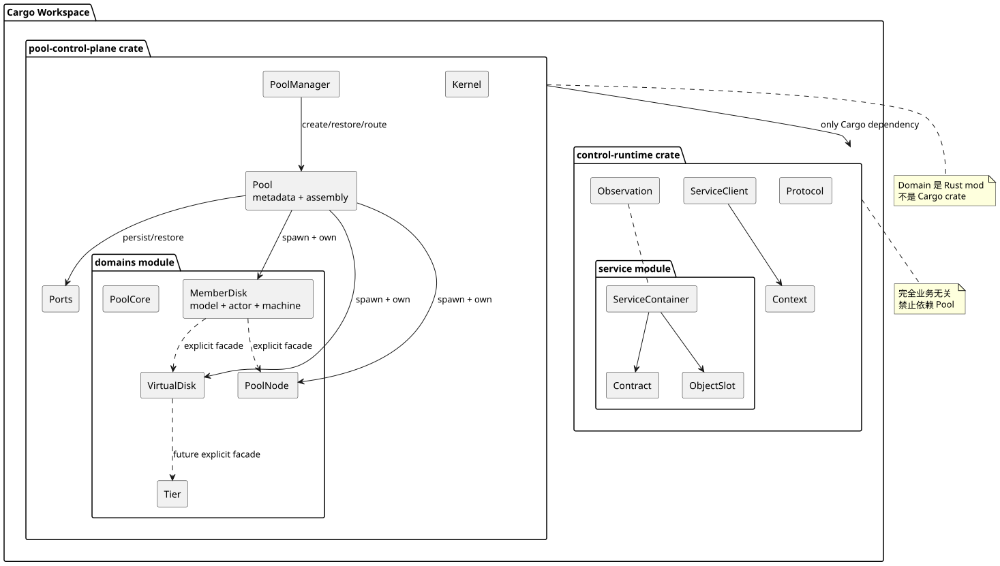

# Pool 管控面 Workspace 与模块边界

状态：已确认并落地。

## 1. 决策

生产 Workspace 只保留两个核心 library crate：

1. `control-runtime`：完全业务无关的进程内 Service Runtime；
2. `pool-control-plane`：整个 Pool 管控面业务。

MemberDisk、VirtualDisk、Tier、PoolNode、PoolCore 等 Domain 是
`pool-control-plane` 内的 Rust module，不是独立 Cargo package。

这是一次有意的减法。早期 `domain/api + domain/service` 方案能够强化编译期依赖，
但对当前单仓库、单进程、共同发布的 Monitor 业务没有足够收益，反而增加：

- Cargo manifest 和 crate root 数量；
- Request/Reply 与实现之间的导航距离；
- 为跨 crate 使用而扩大 `pub` 可见性的压力；
- 普通开发者理解和修改一个领域 Workflow 的成本。

## 2. Package、crate 和 module

```text
Cargo package
└── src/lib.rs          library crate 的默认根文件
    └── mod domain      crate 内部 Rust module
```

`lib.rs` 不是与 crate 对立的概念。一个包含 `Cargo.toml` 和 `src/lib.rs` 的目录，
就是一个 library crate。当前选择是“整个 Pool 业务一个 crate、每个领域一个 mod”。

## 3. 目标目录

```text
kube-managed-future-runner/
├── Cargo.toml
├── Cargo.lock
├── crates/
│   ├── foundation/
│   │   └── control-runtime/
│   │       └── src/
│   │           ├── lib.rs
│   │           ├── protocol.rs
│   │           ├── context.rs
│   │           ├── client.rs
│   │           ├── observation.rs
│   │           ├── state_cell.rs
│   │           ├── state_machine.rs
│   │           └── service/
│   │               ├── mod.rs
│   │               ├── contract.rs
│   │               ├── container.rs
│   │               ├── service_loop.rs
│   │               └── actor_cell.rs
│   │
│   └── pool-control-plane/
│       └── src/
│           ├── lib.rs
│           ├── pool_manager.rs
│           ├── ports.rs
│           ├── kernel/
│           │   └── mod.rs
│           ├── pool/
│           │   ├── mod.rs
│           │   ├── model.rs
│           │   └── instance.rs
│           ├── domains/
│           │   ├── mod.rs
│           │   ├── member_disk/
│           │   │   ├── mod.rs
│           │   │   ├── protocol.rs
│           │   │   ├── model.rs
│           │   │   ├── machine.rs
│           │   │   └── service.rs
│           │   ├── virtual_disk/
│           │   ├── pool_node/
│           │   ├── tier/             # 后续
│           │   └── pool_core/        # 后续
└── scripts/
    └── verify_architecture.py
```



图源：[package-workspace-layout.puml](diagrams/package-workspace-layout.puml)

## 4. `control-runtime` 的职责

`control-runtime` 是唯一值得独立复用和隔离的基础 crate。它提供：

- 每个 Service 一个根 Tokio task；
- 业务通道与控制通道；
- `FuturesUnordered` 统一 poll Workflow Future；
- 私有 ActorCell 的 `Idle/Pending/Running/Cancelling` 执行状态；
- `Transition::to(...).ensure(...)` 公共状态机原语；
- 指向明确 Service 实例的类型化 `ServiceClient` 和 oneshot 调用；
- Operation/Call/Task 因果上下文；
- 结构化取消、Service 生命周期和观测；
- 不允许锁 Guard 跨越 `.await` 的 `StateCell`。

它不能出现 Pool、Disk、Node、VD、BG、BLK、Tier、Rebuild、SDB 等业务知识。

内部原来的 `runtime.rs` 已拆为 `service/container.rs` 与 `service/service_loop.rs`：
前者只保存配置、控制句柄和 Service 所有权，后者保存根 task 的事件循环。整个
crate 已经是 Runtime，不再创建含义重复的 `runtime.rs`。

## 5. `pool-control-plane` 的职责

`pool-control-plane` 保存全部 Pool 业务知识：

- 稳定业务 ID 和值对象；
- Domain 私有核心元数据；
- Domain Request/Reply/Event；
- 状态图和领域不变量；
- 自然 `async fn` Workflow；
- Monitor 级 `PoolManager`、独立 `Pool`、Pool 元数据 CRUD、SDB Port 和外部事实路由；
- 一个 Pool 的 Service 创建、生命周期和领域业务入口。

它依赖 `control-runtime`，反向依赖永远不允许。

## 6. Domain module 约定

一个领域的推荐最小结构：

```text
domains/member_disk/
├── mod.rs
├── protocol.rs
├── model.rs
├── machine.rs
├── service.rs
└── workflows/          # 只有 service.rs 过大时再创建
```

不要为了目录对称创建空文件。简单领域可以只有 `mod.rs + protocol.rs + service.rs`。

### `protocol.rs`

保存模块内部 Command/Response。对外优先暴露命名的 Service facade 方法，使普通调用者不需要理解请求枚举或 oneshot：

- Request/Reply；
- DomainEvent；
- 不可变 View；
- 调用方必须处理的稳定业务结果。

不能暴露可变元数据、锁、Repository 实现或 SDB Key 布局。

### `machine.rs`

只保存纯状态迁移：

```rust
(Ua, PhysicalDown) => Transition::to(Da).ensure(Offline)
```

它不读取当前对象活动，也不持有 Actor、Client、锁、Future 或 task。

### `model.rs`

保存该领域完整核心实体和值对象。MemberDisk 的容量、Tier、故障域、物理观测、空间位图、分配状态和成员状态都在同一个 `MemberDisk` 中，不再为读取或持久化另建 Snapshot/Record 业务模型，也不得被 `machine.rs` 中的状态枚举取代。

### `service.rs`

保存：

- 私有领域对象目录；
- `impl Service`；
- 状态机结果到 Runtime 请求计划的薄适配；
- 自然 async Workflow；
- 跨领域 facade 调用。

领域目录不得出现 `actor.rs`。ActorCell 是 `control-runtime` 的私有实现，业务开发者不接触。

## 7. 可见性就是边界

领域核心元数据保持私有：

```rust
pub struct MemberDiskService {
    client: ServiceClient<MemberDiskCommand>,
}

struct MemberDiskWorker {
    disks: StateCell<HashMap<MemberDiskId, MemberDisk>>,
    virtual_disks: VirtualDiskService,
}
```

其他领域只能使用公开 facade：

```rust
self.virtual_disks
    .evacuate_member_disk(&context, disk)
    .await?;
```

同一个 crate 消除了 Cargo 循环依赖，但不代表允许直接访问其他领域元数据。
边界由模块私有性、显式 facade、测试和代码审查共同保持。

## 8. Domain、Service、Task 不等价

```text
Domain module
    业务知识和源码所有权边界

Service struct
    Domain 对外提供的运行能力

ServiceContainer
    Runtime 执行和控制一个 Service 的容器

Tokio root task
    ServiceContainer 的根执行载体

Workflow Future
    Service 上运行的一次业务收敛流程
```

把 Domain 改成 module 不会改变每个 Service 独立根 task 的运行模型。

## 9. 什么时候才升级成独立 crate

只有出现至少一项真实需求时才考虑把 module 提升为 crate：

1. 被 Pool 之外的多个产品复用；
2. 独立发布、版本兼容或 feature 管理；
3. 被多个进程或二进制以不同组合链接；
4. 构建时间已经证明需要物理隔离；
5. 模块边界长期被破坏，且轻量检查无法约束。

“它是一个重要领域”本身不是拆 crate 的理由。

## 10. 当前实现状态

- 已完成：`control-protocol` 合并进 `control-runtime::protocol`；
- 已完成：`runtime.rs` 重组为 `service/contract + container + service_loop + actor_cell`；
- 已完成：Pool Kernel 合并为 `pool-control-plane::kernel`；
- 已完成：MemberDisk、VirtualDisk、PoolNode 合并为 Domain modules；
- 已完成：`PoolManager -> Pool -> Domain Service` 多 Pool 装配和场景测试；
- 已完成：Pool 元数据 CRUD、SDB Port 与冷恢复纵切面；
- 已完成：MemberDisk 完整实体、BLK 位图和声明式状态图；
- 已完成：显式 Service facade，移除请求自带目标和全局自动路由；
- 已完成：私有 ActorCell 实际执行对象意图的 Join/Queue/Replace/Settle；
- 已完成：生产 Workspace 收敛为两个 crate；
- 待实现：Tier/Partition、完整 VD/BG/PoolNode、真实 SDB Adapter 与 reconcile。

## 11. 验证

```text
cargo fmt --all --check
cargo test --workspace
cargo clippy --workspace --all-targets -- -D warnings
python3 scripts/verify_architecture.py
```

架构脚本同时拒绝：

- `control-runtime -> pool-control-plane` 反向依赖；
- `pool-control-plane/src/domains` 中出现嵌套 `Cargo.toml`。
